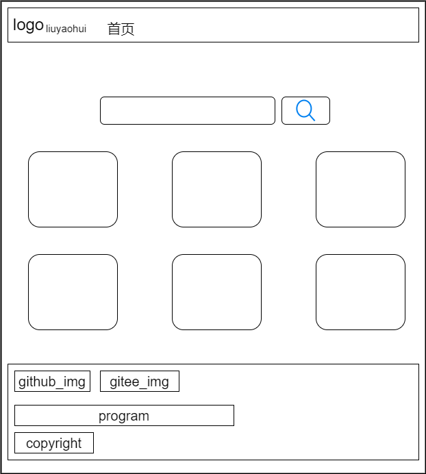
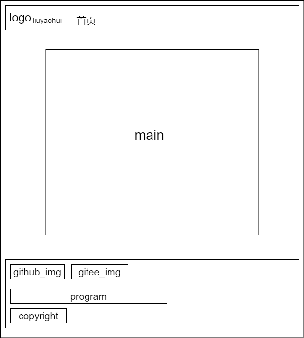

# 个人博客项目设计
1. [项目进度](#项目进度)
2. [草图布局设计](#草图布局设计)
3. [markdown\_view\_page布局设计](#markdown_view_page布局设计)
4. [测量工具](#测量工具)
5. [布局样式库](#布局样式库)
6. [markdown转译文本库](#markdown转译文本库)
7. [search卡组筛选](#search卡组筛选)
8. [阅读跳转markdown预览](#阅读跳转markdown预览)

## 项目进度
1. 设计草图 ✅
2. UI布局设计 ✅
3. html + css + javascrip完成前端 ✅
4. 数据后端因为内容不多，暂且选择json文件存储 ✅
5. 完成markdown文本转html的功能 ✅
6. 添加搜索功能 ✅
7. 后续添加修改markdown文档 ✅
8. 完成markdown文档预览 ❌
9. 数据动态渲染 ❌

## 草图布局设计
* header
    * logo
    * website_name

* search
    * input
    * search_button_icon
    * home_text

* main
    * 3 card in a row

* footer
    * github_img gitee_img google
    * program_img: children_program_link front_program_link ske_program_link
    * copyright liuyaohui 2022. All Rights Reserverd

[回到顶部](#blog设计思路)

## markdown_view_page布局设计
* header
* main
* footer

[回到顶部](#blog设计思路)

## 测量工具
pxcook

[回到顶部](#blog设计思路)

## 布局样式库
* bootstrap_reboot.min.css
* bootstrap_grid.min.css

[回到顶部](#blog设计思路)

## markdown转译文本库
* marked.min.js
* highlight.min.js

[回到顶部](#blog设计思路)

## search卡组筛选
input search监听input事件，改变卡组样式

[回到顶部](#blog设计思路)

## 阅读跳转markdown预览
存储相关值进localstorage，跳转到转译页面，根据localstorage的文件转译，提供相应的详细文件链接

[回到顶部](#blog设计思路)
