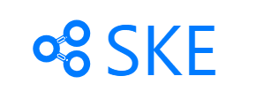
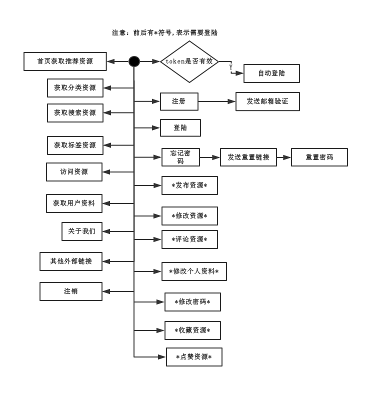
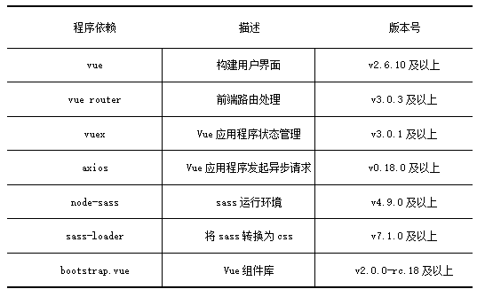
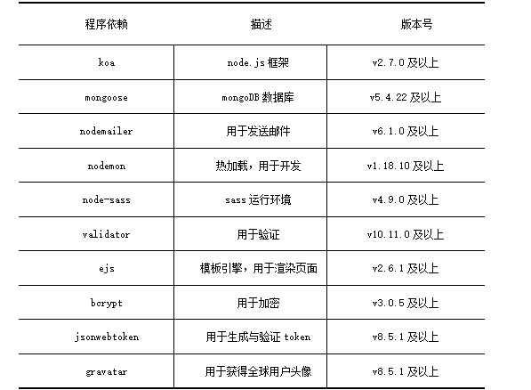

Share Knowledge EveryWhere

知识分享网站项目

# ske知识分析网站
1. [项目基本信息](#项目基本信息)
2. [功能描述](#功能描述)
3. [前端部分的开发环境](#前端部分的开发环境)
4. [后端部分的开发环境](#后端部分的开发环境)
5. [版本](#版本)

## 项目基本信息
这是一个基于 Vue + Koa + mongoose 创建的前后端分离的知识分享网站项目。欢迎大家一起参与共同构建一个知识分享社区，本项目可用于个人学习。

## 功能描述
现在拥有的功能如下图所示

</img>

[回到顶部](#ske知识分析网站)

## 前端部分的开发环境

</img>

[回到顶部](#ske知识分析网站)

## 后端部分的开发环境

</img>

[回到顶部](#ske知识分析网站)

## 版本
ske v2.0

[回到顶部](#ske知识分析网站)
