# 小学数学
1. [数的认识](#数的认识)
    1. [整数](#整数)
    2. [小数](#小数)
    3. [分数和百分数](#分数和百分数)
    4. [数之间的关系](#数之间的关系)
    5. [因数和倍数](#因数和倍数)
    6. [正数和负数](#正数和负数)
2. [数的运算](#数的运算)
    1. [加法和减法](#加法和减法)
    2. [乘法和除法](#乘法和除法)
    3. [混合运算](#混合运算)
3. [常见的计量单位](#常见的计量单位)
4. [式与方程](#式与方程)
5. [比和比例](#比和比例)
6. [空间与图形](#空间与图形)
    1. [线](#线)
    2. [角](#角)
    3. [平面图形](#平面图形)
        1. [三角形](#三角形)
        2. [四边形](#四边形)
        3. [圆](#圆)
    4. [立体图形](#立体图形)
        1. [长方体](#长方体)
        2. [正方体](#正方体)
        3. [圆柱](#圆柱)
        4. [圆锥](#圆锥)
    5. [图形的位置](#图形的位置)
    6. [图形的变换](#图形的变换)
7. [统计与概率](#统计与概率)
8. [综合应用](#综合应用)
    1. [基本数量关系](#基本数量关系)
    2. [常见数量关系](#常见数量关系)
    3. [探索规律](#探索规律)
    4. [其他常见问题](#其他常见问题)
        1. [平均数问题](#平均数问题)
        2. [年龄问题](#年龄问题)
        3. [鸡兔同笼问题](#鸡兔同笼问题)
        4. [植树问题](#植树问题)
        5. [天平找次品问题](#天平找次品问题)
        6. [抽屉原理问题](#抽屉原理问题)
        7. [搭配问题](#搭配问题)
        8. [优化统筹问题](#优化统筹问题)
        9. [盈亏问题](#盈亏问题)
        10. [最值问题（烙饼）](#最值问题烙饼)
        11. [牛吃草问题](#牛吃草问题)
        12. [方阵问题：](#方阵问题)
        13. [构图步数问题](#构图步数问题)
        14. [幻方问题](#幻方问题)

## 数的认识

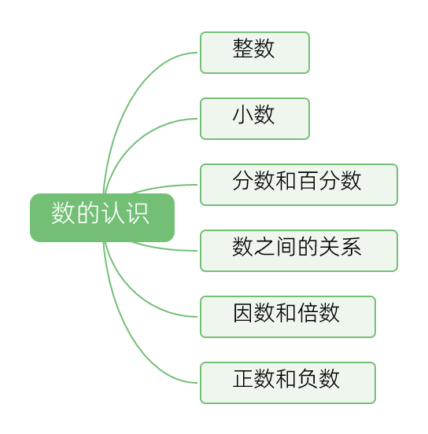

  ⭐⭐⭐⭐⭐⭐⭐   

### 整数
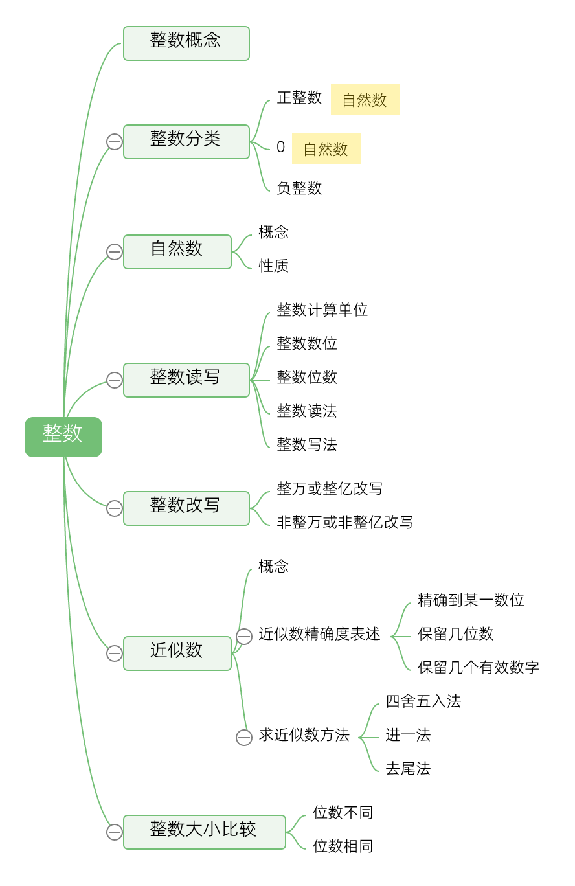

1. 整数概念：正整数、零、负整数的集合。例如，-3、-2、-1、0、1、2、3等都是整数
2. 整数分类
    * 正整数：大于 0 的整数，如 1、2、3……是自然数的一部分
    * 0：既不是正整数也不是负整数，也是自然数的一部分
    * 负整数：小于0的整数，如-1，-2，-3...
3. 自然数：
    * 概念：计量事物的件数或表示事物次序的数，是 0 和正整数的集合。例如，0，1，2，3，4······所表示的数，其中0是最小的自然数
    * 性质：有顺序性、无限性

4. 整数读写：
    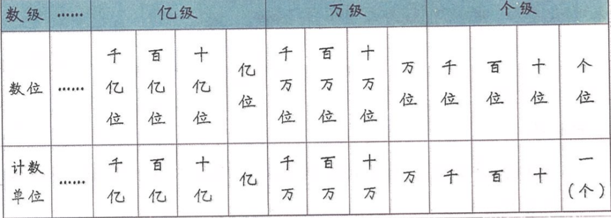
    
    * 整数计数单位：一，十，...，千亿...都是整数的计数单位，每相邻两个计数单位进率都是十
    * 整数数位：整数的计数单位，按照一定的顺序排列，它们所占的位置叫做整数数位。在整数中，从右往左依次为个位、十位、百位、千位、万位、十万位、百万位、千万位、亿位、十亿位、百亿位、千亿位等
    * 计算单位与数位关系：数字 “12345” 中，“5” 在个位上，表示 5 个一；“4” 在十位上，表示 4 个十；“3” 在百位上，表示 3 个百；“2” 在千位上，表示 2 个千；“1” 在万位上，表示 1 个万
    * 整数位数：一个整数所占的数位个数，例如，`数字 123 是三位数，数字 98765 是五位`
    * 整数的读法：
        * 先分级：从右到左每四位一级，依次是个级（个位、十位、百位、千位）、万级（万位、十万位、百万位、千万位）、亿级（亿位、十亿位、百亿位、千亿位）等
        * 从高位到低位度起，一级一级读，如亿级 -- 万级 -- 个级
        * 读亿级、万级时，先按照个级的读法去读，再在后面加一个“亿”字或“万”字
        * 每一级中，末尾的0都不读出来，其它数位连续有几个0都只读一个零
        * 例如，`70-0005-0005读作七十亿零五万零五；10203040 读作一千零二十万三千零四十`
    * 整数的写法：
        * 从高位到低位写起，一级一级地写，如亿级 -- 万级 -- 个级
        * 数位上一个单位也没有，就在那个数位上写0占位
        * 例如，`五千六百七十八写作5678；一亿零三百写作100000300` 

5. 整数改写：
    * 整万或整亿改写成用“万”或者“亿”作单位的数：
        * 改成万作单位的数，去掉个级的4个0，写上“万”字
        * 改成“亿”作单位的数，去掉个级和万级的8个0，写上“亿”字
        * 例如，`560000 = 56万；120000 = 12万；1200000000 = 12亿`
    * 非整万或非整亿改写成以“万”或“亿”为单位的数
        * 在万位或者亿位后面点上小数点，去掉末尾的0，最后加上亿或者万
        * 例如`77000 = 7.7万`

6. 近似数：
    * 近似数概念：与准确数相近的数，一般用约等号 “≈” 表示近似数
    * 近似数精确度表述：
        * 精确到某一数位：如果是用四舍五入法求近似数，就对这个数位的下一位的数字进行四舍五入，例如`整数 12345精确到千位，精确到千位，就要看百位数字，百位是 3，小于 5，把百位及后面的数舍去，12345≈12000`
        * 保留几位数：如果是用四舍五入法求近似数，就数到要求的位数，根据下一位数字进行四舍五入，例如，`将整数 12345 保留到千位，就看百位数字，百位是 4，小于 5 舍去，12345≈12000`
        * 保留几个有效数字（从左边第一个不是0的数字起，到精确到的位数止，所有的数字都叫做这个数的有效数字）：如果是用四舍五入法求近似数，就数对应的有效数字，根据下一位数字进行四舍五入，例如，`12345 保留两位有效数字，从左边第一个不为零的数字 1 开始数，两位有效数字就是 1 和 2。后面的数字根据四舍五入进行处理，3 小于 5，直接舍去`
    * 求近似数方法
        * 四舍五入法：这是最常用的方法。如果尾数的最高位数字是4或者比4小，就把尾数去掉；如果尾数的最高位数是5或者比5大，就把尾数舍去并且在它的前一位进“1”。例如`将3.1415926精确到百分位，因为千分位是1，小于4，所以舍去，得到3.14`
        * 进一法：在取近似数时，不管尾数最高位上的数字是几，都要向前一位进一。
        * 去尾法：在取近似数时，不管尾数最高位上的数字是几，都把尾数去掉。例如：用布做衣服，一块布可以做3.8件衣服，实际只能做3件，这里就采用去尾法取近似数

7. 整数大小比较
    * 位数不同：位数多的数大。例如，1234 > 987
    * 位数相同：从最高位比起，最高位上的数大的那个数就大；如果最高位上的数相同，就比较下一位，直到比较出大小为止。例如，1234 < 1256

[回到顶部](#小学数学)
  ⭐⭐⭐⭐⭐⭐⭐   

### 小数
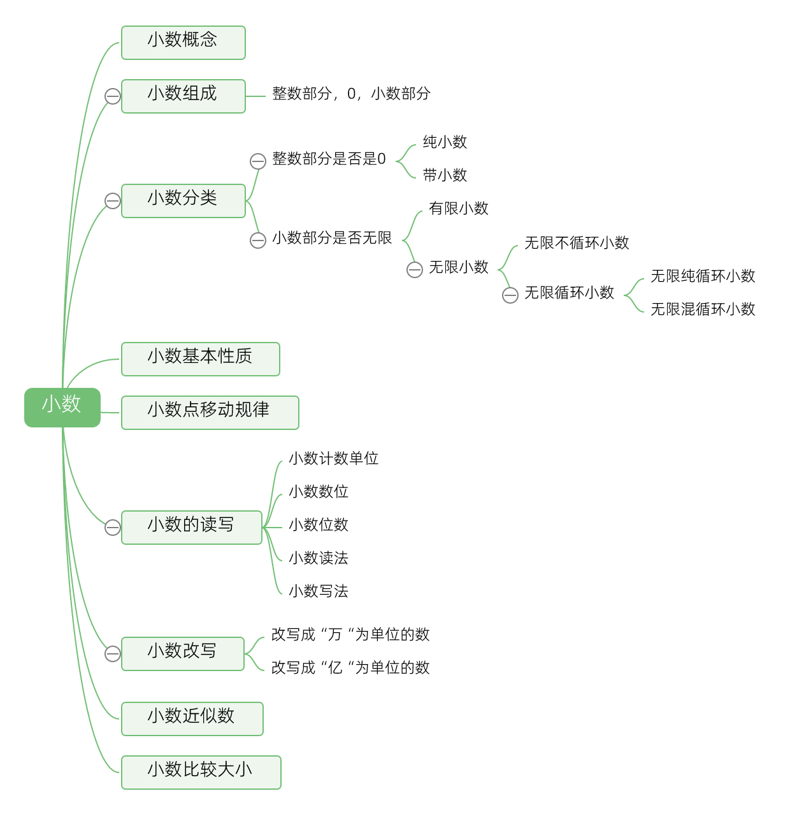

1. 小数概念：
    * 把整数 “1” 平均分成 10 份、100 份、1000 份…… 这样的一份或几份是十分之几、百分之几、千分之几…… 写成不带分母的形式，可以用小数表示
    * 例如把 “1” 平均分成 10 份，其中的 1 份就是1/10，用小数表示为0.1。把“1”分成100份，其中的35份是35/100，用小数表示为0.35
    * 0.1表示十分之一，0.01 表示百分之一，0.001 表示千分之一
2. 小数组成：由整数部分、小数部分和小数点组成。小数点是小数中整数部分与小数部分的分界号，小数点左边的数叫做整数部分，小数点右边的数叫做小数部分

3. 小数分类
    * 整数部分是否是0：
        * 纯小数：整数部分是零的小数，叫做纯小数。例如：0.25、0.368 都是纯小数
        * 带小数：整数部分不是零的小数，叫做带小数。例如：3.25、5.26 都是带小数
    * 小数部分是否无限：
        * 有限小数：小数部分的数位是有限的小数，叫做有限小数。例如：41.7、25.3、0.23 都是有限小数
        * 无限小数：小数部分的数位是无限的小数，叫做无限小数。
        * 无限小数又可以分为无限循环小数和无限不循环小数
            * 无限不循环小数：一个数的小数部分，数字排列无规律且位数无限，这样的小数叫做无限不循环小数。例如，`圆周率π = 3.1415926……；自然常数 e = 2.71828……`
            * 无限循环小数：一个数的小数部分，有一个数字或者几个数字依次不断重复出现，这个数叫做循环小数。例如：3.555……、0.0333……、12.109109…… 一个循环小数的小数部分，依次不断重复出现的数字叫做这个循环小数的循环节，例如，`3.99…… 的循环节是 “9”；0.5454…… 的循环节是 “54”`
                * 无限纯循环小数：循环节从小数部分第一位开始的，叫做纯循环小数，例如，`3.111…… `
                * 无限混循环小数：循环节不是从小数部分第一位开始的，叫做混循环小数，例如，` 3.1222……；0.03333……`
        
4. 小数基本性质：小数的末尾添上“0”或去掉“0”，小数的大小不变。例如，1.2 = 1.20 = 1.200

5. 小数点移动规律：
    * 小数点向右移动：小数点向右移动是扩大，右移一位相当于乘 10，右移两位乘 100，右移三位乘 1000……
    * 小数点向左移动：小数点向左移动是缩小，左移一位除以 10，左移两位除以 100，左移三位除以 1000…… 

6. 小数的读写
    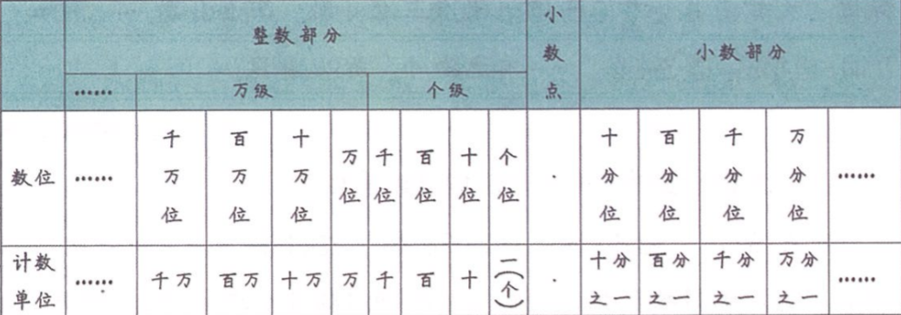

    * 小数计数单位：十分之一、百分之一、千分之一……分别写作 0.1、0.01、0.001……每相邻两个小数计数单位间的进率是 10，小数部分的最高分数单位 “十分之一” 和整数部分的最低单位 “一” 之间的进率也是 10
    * 小数数位：小数的计数单位，按照一定的顺序排列，它们所占的位置叫做小数数位。小数计算单位从左往右依次排列，依次为十分位、百分位、千分位、万分位……
    * 小数位数：小数部分的数字占的数位个数，例如，`小数 3.14 有两位小数，小数 0.5678 有四位小数`
    * 小数读法：
        * 整数部分按照整数读
        * 小数点读作点
        * 小数部分每个数字都要读出来
        * 例如，`3.56 读作 “三点五六”，12.006 读作 “十二点零零六”`
    * 小数写法：
        * 整数部分按照整数读
        * 点写成小数点
        * 小数部分每个数字都要写出来
        * 例如，`零点二五写作 0.25，十二点零八写作 12.08s`
   
7. 小数改写
    * 改写成“万“为单位的数： 从个位起向左数四位点上小数点，末尾的零去掉，再加上 “万” 字，例如，`12345.67 = 1.234567万` 
    * 改写成“亿“为单位的数： 从个位起向左数八位点上小数点，末尾的零去掉，再加上 “亿” 字，例如，`123456789 = 1.23456789亿`

8. 小数近似数：和整数近似数一样

9. 小数比较大小
    * 先比较整数部分，整数部分大的那个数就大
    * 整数部分一样，先比较十分位，十分位的数大的则大，十分位上的数也相同的，百分位上的数大的那个数就大…… 以此类推
    * 例如，`2.5 > 1.8；1.23 > 1.21`

[回到顶部](#小学数学)
  ⭐⭐⭐⭐⭐⭐⭐   

### 分数和百分数
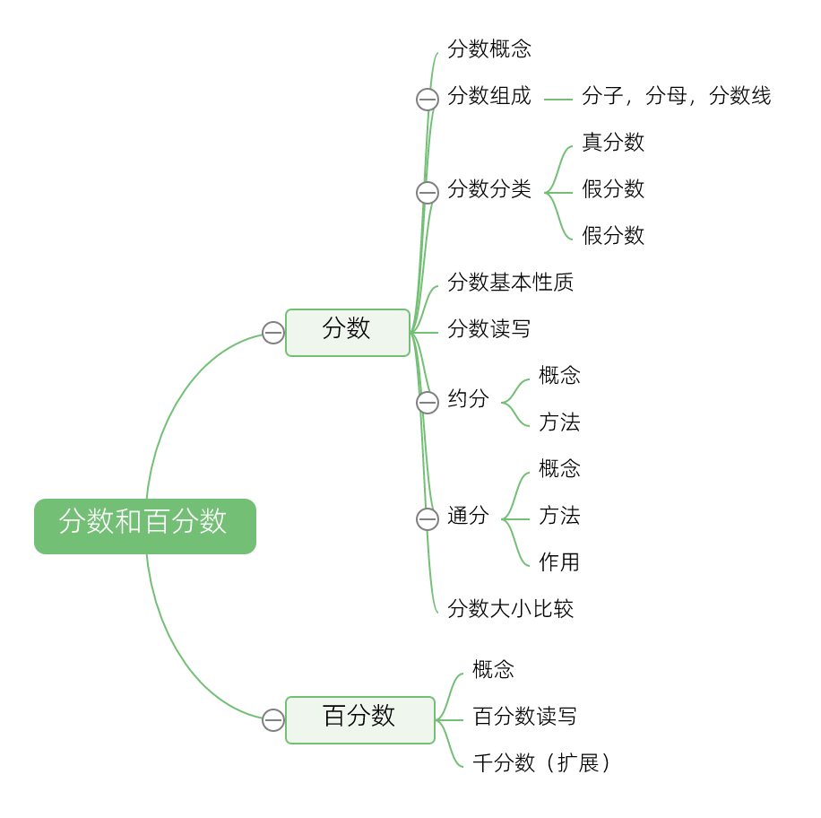

分数
1. 分数概念：把单位1分成若干份，表示这样的一份或者若干份的数，叫做分数。例如把一个蛋糕平均分成四份，其中的一份就是1/4
2. 分数组成：
    * 分子：表示取的份数。例如1/4中的1，表示取了一份
    * 分数线：相当于除号和比号，具有分割分子和分母的作用
    * 分母：表示平均分成的份数，例如1/4的4中，表示取了4份
3. 分数分类：
    * 真分数：分子小于分母的分数，真分数小于1，例如`2/3，4/7`
    * 假分数：分子大于或者等于分母的分数，假分数大于或者等于1，例如`7/7 ，8/4`
    * 假分数可以写成整数与真分数合成的数，叫做带分数，例如，\(2\frac{1}{3}\)，读作二又三分之一

4. 分数基本性质：分子和分母同时乘以或除以不为0的数，分数大小不变。例如，\(\frac{2}{3}=\frac{2\times2}{3\times2}=\frac{4}{6}\)，\(\frac{6}{9}=\frac{6\div3}{9\div3}=\frac{2}{3}\)

5. 分数读写：
    * 分数读法：
        * 真分数和假分数读法：先读分母，再读 “分之”，最后读分子。例如，`3/5 读作五分之三`
        * 带分数的读法是先读整数部分，再读 “又”，然后读分数部分。例如，\(2\frac{5}{3}\) 读作 二又三分之之五
    * 分数写法：
        * 真分数和假分数的写法：先写分数线，分数线下面写分母，分数线上面写分子
        * 例如，写五分之三，先写分数线 “—”，在分数线下面写 “5” 作为分母，在分数线上面写 “3” 作为分子，即 \(\frac{3}{5}\)   

6. 约分：
    * 概念：把一个分数化成同它相等，但分子、分母都比较小的分数，叫做约分
    * 方法：利用分数基本性质，分子分母共同除以它们的公因数（1 除外），将分子分母化成相等，但分子分母都比较小的数。可以逐步除以分子分母的工因数实现逐次约分，也可以分子分母除以最大的公因数
    * 最简分数：分子和分母只有公因数 1 的分数，分子分母互质，叫做最简分数

7. 通分：
    * 概念：异分母的分数化为原分数相等的同分母分数，叫做通分
    * 方法：求出几个异分母分数的分母的最小公倍数，这个最小公倍数就是通分后的公分母，然后根据分数的基本性质，把每个分数的分子分母同时扩大相应的倍数，使得分母都变为公分母
    * 例如，`1/2 1/3 1/4`进行通分，2，3，4的最小公倍数是12，所以公分母是 12，将各自分母乘上相应倍数即可`1/2 = 2/12 1/3 = 3/12 1/4 = 4/12`
    * 作用：通分可以将异分母分数转化为同分母分数，便于进行分数的大小比较和加减运算

8. 分数大小比较：
    * 同分母分数比较大小：分子大的分数大。例如，`3/5 2/5，因为3＞2，所以3/5 > 2/5`
    * 同分子分数比较大小：分母小的分数大。例如，`2/3 2/5，因为3<5, 所以2/3 > 2/5`
    * 分子分母不同的分数比较大小：先通分，化为同分母分数后再比较大小
    * 带分数：先比较整数部分，再比较分数部分

 
 
 

百分数：
1. 百分数概念：表示一个数是另外一个数的百分之几，也叫百分率或者百分比，百分数通常用“%”来表示。例如，45%表示一个数是另一个数的百分之四十五

2. 百分数读写：  
    * 百分数读法：先读百分号，读作“百分之”，再读数字。例如，`百分之三十写作 30%`
    * 百分数写法：先写数字，再在数字后面加上百分号“%”。例如，`例如，百分之三十写作 30%`

3. 千分数（扩展）：和百分数差不多，表示一个数是另外一个数的千分之一，千分数通常用“‰”来表示。例如，45‰表示一个数是另一个数的千分之四十五
      

 

[回到顶部](#小学数学)
  ⭐⭐⭐⭐⭐⭐⭐   

### 数之间的关系

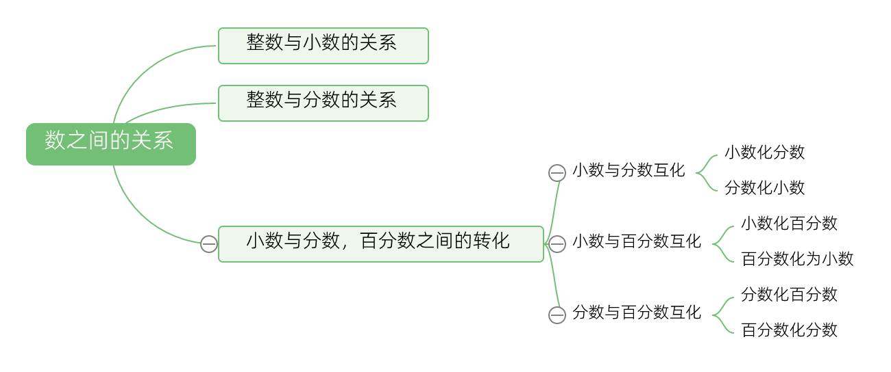

数之间的关系
1. 整数与小数的关系：整数可以看作是小数部分为 0 的特殊小数，例如，2 = 2.0
2. 整数与分数的关系：整数可以看作是分母为 1 的分数，例如，3 = \(\frac{3}{1}\)
3. 小数与分数，百分数之间的转化
    * 小数与分数互化
        * 小数化分数：有限小数可以先把小数写成分母是 10、100、1000……的分数，再化简，例如，(0.25=\frac{25}{100}=\frac{1}{4}\)
        * 分数化小数：用分子除以分母。例如\(\frac{3}{4}=3\div4=0.75\)
    * 小数与百分数互化
        * 小数化百分数：把小数点向右移动两位，再加上百分号，例如，0.85 化为百分数是 85%
        * 百分数化为小数：去掉百分号，将小数点向左移动两位，例如，56%化为小数是 0.56
    * 分数与百分数互化
        * 分数化百分数：先把分数化成小数（除不尽时，通常保留三位小数），再把小数化成百分数，例如，\(\frac{1}{4}=0.25=25\%\)
        * 百分数化分数：先把百分数写成分母是 100 的分数，再化简，例如，50%化为分数是\(\frac{50}{100}=\frac{1}{2}\)

[回到顶部](#小学数学)
  ⭐⭐⭐⭐⭐⭐⭐   

### 因数和倍数

  ⭐⭐⭐⭐⭐⭐⭐   

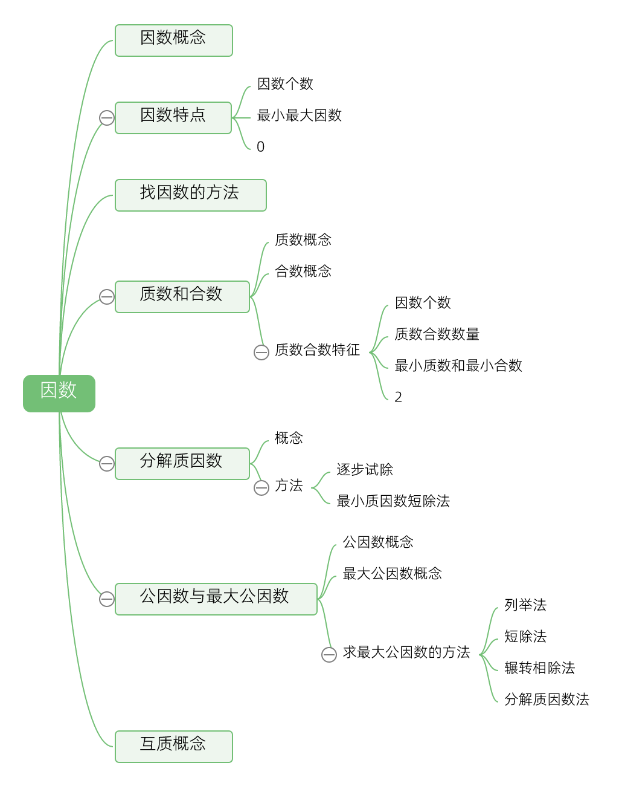

因数
1. 因数概念：整数 a 除以整数 b (b≠0) 的商正好是整数而没有余数，我们就说 b 是 a 的因数。例如 12÷3 = 4，这里 3 和 4 都是 12 的因数。因为 12 能被 3 和 4 整除而没有余数，15 的因数有 1、3、5、15，因为 15 可以被这些数整除

2. 因数特点：
    * 因数个数：一个数的因数的个数是有限的
    * 最小最大因数：最小的因数是 1，最大的因数是它本身
    * 0：不能作为一个数的因数，因为 0 不能做除数，所以 0 不能作为一个数的因数

3. 找因数的方法(枚举法)：用这个数分别除以从 1 开始的整数，如果商是整数且没有余数，那么除数和商都是这个数的因数。例如找 24 的因数，可以从 24÷1 = 24，24÷2 = 12，24÷3 = 8，24÷4 = 6，从而得到 24 的因数有 1、2、3、4、6、8、12、24

4. 质数和合数
    * 质数概念：质数又称素数。一个大于 1 的自然数，除了 1 和它自身外两个因数，不能被其他自然数整除的数叫做质数。例如，5 只能被 1 和 5 整除，7 只能被 1 和 7 整除，所以 5 和 7 是质数
    * 合数概念：自然数中除了能被 1 和本身整除外，还能被其他数（0 除外）整除的数。例如，4 除了能被 1 和 4 整除外，还能被 2 整除；9 除了能被 1 和 9 整除外，还能被 3 整除，所以 4 和 9 是合数
    * 质数合数特征：
        * 因数个数：质数有两个因数（1和它本身），合数至少有三个因数
        * 质数合数数量：所有大于 1 的自然数不是质数就是合数，质数和合数的个数都是无限的
        * 最小质数和最小合数：最小的质数是2，最小的合数是4
        * 2：是最小的质数，也是唯一的偶质数。其他的质数都是奇数 

5. 分解质因数：
    * 概念：把一个合数写成几个质数相乘的形式（只有合数可以分解质因数）
    * 方法
        * 逐步试除：从最小的质数开始试除这个合数，如果能整除，就将这个合数除以这个质数得到商，再用商继续试除。比如分解 63，从 2 开始试除，发现 63 不能被 2 整除；再用 3 试除，63÷3 = 21，接着用 3 试除 21，21÷3 = 7，7 是质数。所以 63 = 3×3×7
        * 最小质因数短除法： 
            * 首先用这个合数最小的质因数去除这个合数，得到商
            * 再用所得商的最小质因数继续去除，如此反复，直到商为质数为止
            * 最后把所有的除数和最后的商写成连乘的形式，就是这个合数的质因数分解形式
            * 例如，分解 48 的质因数，先用 2 去除 48 得到 24，再用 2 去除 24 得到 12，继续用 2 去除 12 得到 6，再用 2 去除 6 得到 3，3 是质数。所以 48 = 2×2×2×2×3

6. 公因数与最大公因数：
    * 公因数概念：给定若干个整数，如果有一个（些）数是它们共同的因数，那么这个（些）数就叫做它们的公因数。例如 12 的因数有 1、2、3、4、6、12，18 的因数有 1、2、3、6、9、18，所以 12 和 18 的公因数有 1、2、3、6
    * 最大公因数概念：公因数中最大的一个称为最大公因数
    * 求最大公因数的方法
        * 列举法：分别列出两个数的所有因数，然后找出它们的公因数中最大的那个。例如求 24 和 36 的最大公因数，24 的因数有 1、2、3、4、6、8、12、24，36 的因数有 1、2、3、4、6、9、12、18、36，它们的公因数有 1、2、3、4、6、12，所以最大公因数是 12
        * 短除法：用这几个数的公因数连续去除，一直除到所得的商只有公因数 1 为止，然后把所有的除数连乘起来，所得的积就是这几个数的最大公因数。例如求 30、45 和 60 的最大公因数，用短除法，先同时除以 3 得到 10、15、20，再同时除以 5 得到 2、3、4，此时它们只有公因数 1，所以 30、45 和 60 的最大公因数是 3×5 = 15
        * 辗转相除法：主要用于求两个较大数的最大公因数。用大数除以小数，再用出现的余数（第一余数）去除除数，再用出现的余数（第二余数）去除第一余数，如此反复，直到最后余数是 0 为止。此时的除数就是这两个数的最大公因数。例如，例如求 492 和 260 的最大公因数，492÷260 = 1……232，260÷232 = 1……28，232÷28 = 8……8，28÷8 = 3……4，8÷4 = 2，此时余数为 0，所以 492 和 260 的最大公因数是 4
        * 分解质因数法：先分别对要求最大公因数的几个数进行分解质因数，找出它们公有的质因数，将这些公有的质因数相乘，所得的积就是这几个数的最大公因数。例如求 36 和 48 的最大公因数，36 = 2×2×3×3，48 = 2×2×2×2×3，36 和 48 公有的质因数是 2、2、3，2×2×3 = 12，所以 36 和 48 的最大公因数是 12

7. 互质概念：两个数的公因数只有1

 
 
 

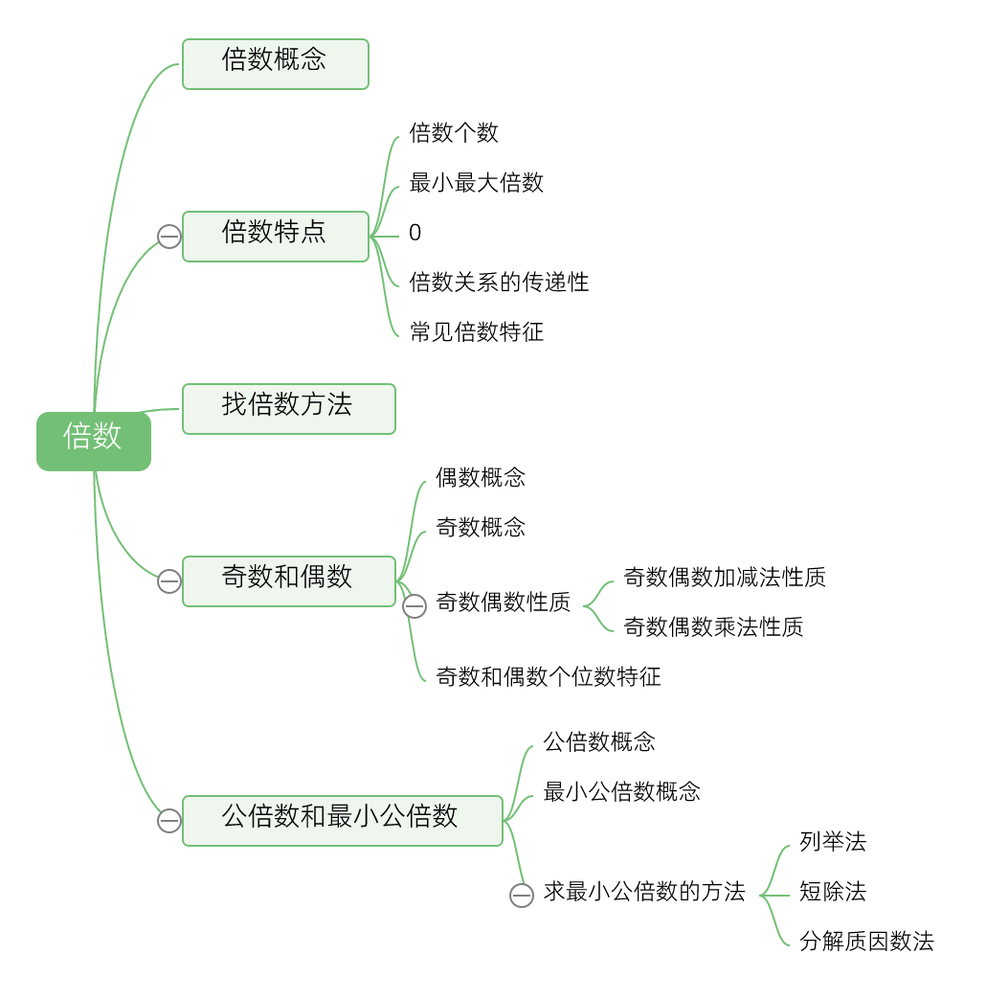

倍数：
1. 倍数概念：如果一个整数 a 能够被另一个整数 b 整除，那么 a 就是 b 的倍数。例如25÷5 = 5，我们就说 25 是 5 的倍数；3 的倍数有 3、6、9、12、15…… 因为 3×1 = 3，3×2 = 6，3×3 = 9，以此类推

2. 倍数特点
    * 倍数个数：一个数的倍数的个数是无限的
    * 最小最大倍数：最小的倍数是它本身，没有最大的倍数
    * 0：0是任何非零整数的倍数，0 除以任何非零整数都得 0，所以 0 是任何非零整数的倍数。例如，0 是 5 的 0 倍，即 0÷5 = 0
    * 倍数关系的传递性：如果 a 是 b 的倍数，b 是 c 的倍数，那么 a 是 c 的倍数。例如，12 是 6 的倍数，6 是 3 的倍数，所以 12 是 3 的倍数
    * 常见倍数特征
        * 2的倍数特征：0，2，4，6，8，0
        * 3的倍数特征：各数位上的和是3的倍数
        * 5的倍数特征：5，0

3. 找倍数方法：用这个数分别乘以 1、2、3、4…… 得到的数都是这个数的倍数。比如找 7 的倍数，7×1 = 7，7×2 = 14，7×3 = 21…… 所以 7 的倍数有 7、14、21……

4. 奇数和偶数：
    * 偶数概念：能够被 2 所整除的整数。例如：0、2、4、6、8、10…… 都是偶数
    * 奇数概念：不能被 2 所整除的整数。例如：1、3、5、7、9、11…… 都是奇数
    * 奇数偶数性质
        * 奇数偶数加减法性质
        * 奇数偶数乘法性质
    * 奇数和偶数个位数特征
        * 个位数字是 0、2、4、6、8 的数是偶数
        * 个位数字是 1、3、5、7、9 的数是奇数

5. 公倍数和最小公倍数
    * 公倍数概念：给定若干个整数，如果有一个（些）数是它们共同的倍数，那么这个（些）数就叫做它们的公倍数。例如 3 的倍数有 3、6、9、12、15、18……，4 的倍数有 4、8、12、16、20……，所以 3 和 4 的公倍数有 12、24、36……
    * 最小公倍数概念：公倍数中最小的一个称为最小公倍数。例如，3 和 4 的最小公倍数是 12
    * 求最小公倍数的方法：
        * 列举法：别列出两个数的一些倍数，然后找出它们的公倍数中最小的那个。例如求 8 和 12 的最小公倍数，8 的倍数有 8、16、24、32……，12 的倍数有 12、24、36……，所以 8 和 12 的最小公倍数是 24
        * 短除法：先用这几个数的公因数连续去除，一直除到所得的商只有公因数 1 为止，然后把所有的除数和最后的商连乘起来，所得的积就是这几个数的最小公倍数。例如求 15、20 和 30 的最小公倍数，用短除法，先同时除以 5 得到 3、4、6，再同时除以 3 得到 1、4、2，此时它们只有公因数 1，所以最小公倍数是 5×3×1×4×2 = 120
        * 分解质因数法：先把每个数分别分解质因数，再把各数中的全部公有的质因数和独有的质因数提取出来连乘，所得的积就是这几个数的最小公倍数。例如求 36、48 和 60 的最小公倍数，36 = 2×2×3×3，48 = 2×2×2×2×3，60 = 2×2×3×5，公有的质因数为 2、2、3，36 独有的质因数为 3，48 独有的质因数为 2×2，60 独有的质因数为 5，所以最小公倍数为 2×2×3×3×2×2×5 = 720

[回到顶部](#小学数学)
  ⭐⭐⭐⭐⭐⭐⭐   

### 正数和负数

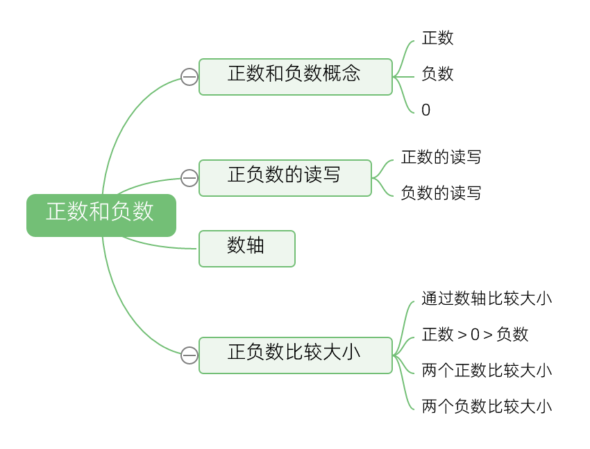

正数和负数：
1. 正数和负数概念
    * 正数概念：大于 0 的数叫做正数，正数前面的 “+” 号可以省略不写。例如，5 是正数，+5 也是正数
    * 负数概念：小于0的数叫做负数，负数前面的 “-” 号是必须要写的。例如，-5 是负数，-10 也是负数
    * 0 既不是正数也不是负数，它是正数与负数的分界点
  
2. 正负数的读写
    * 正数的读写
        * 正数读法：先读出 “正” 字，再读出数字本身。例如，+5 读作正五；+12.5 读作正十二点五，
        * 正数的写法：可以直接写出数字本身，也可以在数字前面加上 “+” 号。例如，五可以写成 5 或 +5；十二点五可以写成 12.5 或 +12.5；
    * 负数的读写
        * 负数的读法：读出 “负” 字，再读出数字本身。例如，-3 读作负三；-8.6 读作负八点六
        * 负数的写法：在数字前面加上 “-” 号。例如，负三写成 -3；负八点六写成 -8.6

3. 数轴：数轴是一条规定了原点、正方向和单位长度的直线，数轴可以直观地表示数的大小和相对位置关系，如，在数轴上，正数在原点的右侧，负数在原点的左侧。数字越往右越大，越往左越小

4. 正负数比较大小
    * 通过数轴比较大小 
    * 正数＞0＞负数
    * 两个正数比较大小：绝对值越大，越大
    * 两个负数比较大小：绝对值大的反而小。例如，-3 和 -5 比较大小，-5 绝对值大，所以 -5 反而小

[回到顶部](#小学数学)
  ⭐⭐⭐⭐⭐⭐⭐   

## 数的运算

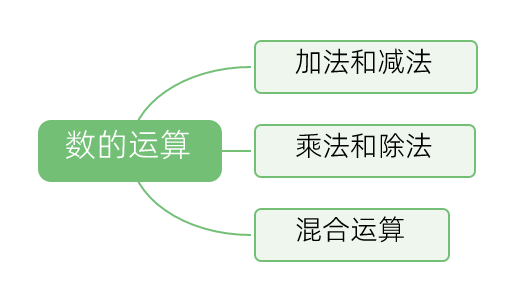

  ⭐⭐⭐⭐⭐⭐⭐   

### 加法和减法

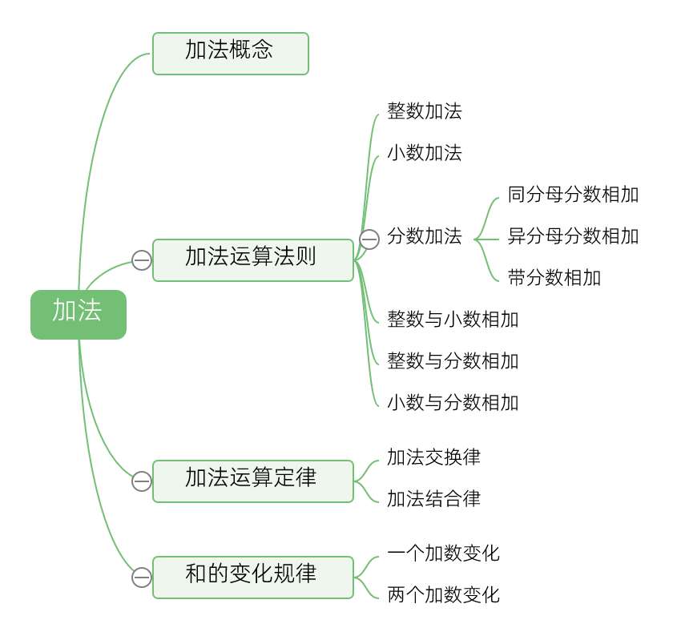

加法

1. 加法概念：将两个或者两个以上的数并在一起，得到它们的总和。`加数 + 加数 = 和`

2. 加法运算法则：
    * 整数加法：
        * 相同数位对齐
        * 从个位加起
        * 哪一位上的数相加满十，就向前一位进一
        * 例如，357 + 246，个位上 7 + 6 = 13，满十向十位进 1，个位写 3；十位上 5 + 4 = 9，再加上个位进位的 1，得 10，满十向百位进 1，十位写 0；百位上 3 + 2 = 5，再加上十位进位的 1，得 6。所以 357 + 246 = 603
    * 小数加法：
        * 小数点对齐
        * 从低位加起
        * 按照整数加法的方法，从右往左依次相加，满十进一
        * 结果点上小数点，和的小数点要与加数的小数点对齐
        * 例如：3.56 + 2.47，小数点对齐后，个位上 3 + 2 = 5；十分位上 5 + 4 = 9；百分位上 6 + 7 = 13，满十向十分位进 1，百分位写 3。所以 3.56 + 2.47 = 6.03 
    * 分数加法（ 在进行分数加法运算时，结果能约分的一定要约分，化为最简分数）：
        * 同分母分数相加：
            * 分母不变，分子相加。
            * 结果能约分的要约分，化为最简分数。
            * 例如，3/8 + 5/8 = 8/8 = 1
        * 异分母分数相加：
            * 先通分，将异分母分数化为同分母分数
            * 然后按照同分母分数加法的法则进行计算
            * 例如，2/3 + 3/4，先通分，2/3 = 8/12，3/4 = 9/12，再进行加法运算，8/12 + 9/12 = 17/12
        * 带分数相加：
            * 先将带分数化为假分数
            * 对假分数进行分数加法运算
            * 例如，3 又 1/4 + 2 又 2/3，先将其化为假分数，3 又 1/4 = 13/4，2 又 2/3 = 8/3。进行分数加法，先通分，13/4 = 39/12，8/3 = 32/12，相加，39/12 + 32/12 = 71/12 = 5 又 11/12
    * 整数与小数相加：
        * 将整数的小数点后补 0，使整数与小数位数对齐
        * 然后从低位向高位依次相加，满十进一
        * 例如，3 + 2.57，将 3 写成 3.00，个位上 3+2=5，十分位上 0+5=5，百分位上 0+7=7，所以 3+2.57=5.57 
        * 其实就是整数部分相加，拼接小数部分
    * 整数与分数相加：
        * 将整数化为与分数分母相同的分数形式
        * 然后按照同分母分数加法的法则进行计算，即分母不变，分子相加
        * 例如，5 + 2/3，将 5 化为 15/3，15/3 + 2/3 = 17/3 = 5 又 2/3
        * 如果分数是带分数，带分数`m又n分之1`，实际上是`m + n分之一`，可以先将带分数的整数部分与给定整数相加，分数部分不变。例如，例如，3+2又1/4，先将带分数的整数部分2与整数3相加得5，分数部分为1/4不变，所以结果是5又1/4
    * 小数与分数相加：
        * 将小数化为分数或者将分数化为小数
        * 如果将小数化为分数，就按照分数加法法则进行计算；如果将分数化为小数，就按照小数加法法则进行计算
        * 例如，0.5 + 1/2，将 0.5 化为 1/2，1/2 + 1/2 = 1。又例如，1.25 + 3/4，将 3/4 化为 0.75，1.25 + 0.75 = 2 
  
3. 加法运算定律:
    * 加法交换律：两个数相加，交换加数的位置，和不变。用字母表示为\(a + b = b + a\)。
    * 加法结合律：三个数相加，先把前两个数相加，或者先把后两个数相加，和不变。用字母表示为\((a + b) + c = a + (b + c)\)。

4. 和的变化规律：
    * 一个加数变化：当一个加数不变，另一个加数增加或减少 m 时，和也增加或减少 m，即` a + b = c ，(a ± m) + b = c ± m ，a + (b ± m) = (c ± m)`。例如，10 + 8 = 18，如果一个加数 10 增加 3 变为 13，另一个加数 8 不变，此时和为 13 + 8 = 21，和增加了 3
    * 两个加数变化：当一个加数增加一个数 m，另一个加数减少同一个数 m，和不变，即 `a + b = c ，(a - m)+(b + m)= c`。例如，10 + 8 = 18，如果一个加数 10 增加 3 变为 13，另一个加数 8 减少 3 变为 5，此时和为 13 + 5 = 18，和不变

 
 
 

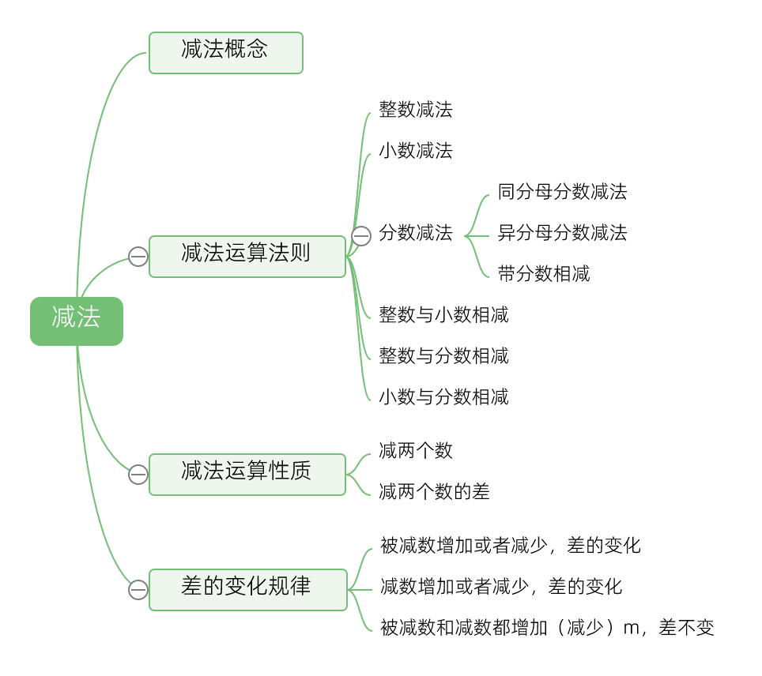

减法
1. 减法概念: 已知两个加数的和与其中一个加数，求另外一个加数的运算。`被减数-减数 = 差`
2. 减法运算法则：
    * 整数减法：
        * 相同数位对齐
        * 从个位减起
        * 哪一位上的数不够减，就从前一位退 1 当 10，与本位上的数相加后再减
        * 例如，532 - 214，个位上 2 减 4 不够减，从十位退 1 当 10，12 - 4 = 8；十位上 3 被借走 1 变为 2，2 减 1 等于 1；百位上 5 减 2 等于 3。所以 532 - 214 = 318 
    * 小数减法：
        * 小数点对齐（也就是把相同数位对齐）
        * 从最低位减起
        * 哪一位上的数不够减，要从前一位退 1 当 10，在本位上加 10 再减
        * 点上小数点，小数点要与被减数、减数的小数点对齐 
        * 例如：5.32 - 2.14，小数点对齐后，个位上 5 减 2 等于 3；十分位上 3 减 1 等于 2；百分位上 2 减 4 不够减，从十分位退 1 当 10，12 - 4 = 8。所以 5.32 - 2.14 = 3.18
    * 分数减法：
        * 同分母分数减法：
            * 分母不变，分子相减
            * 结果能约分的要约分，化为最简分数。
            * 例如，5/8 - 3/8 = 2/8
        * 异分母分数减法：
            * 先通分，将异分母分数化为同分母分数
            * 按照同分母分数减法的法则进行计算
            * 例如，7/4 - 5/3，先通分，7/4 = 21/12；5/3 = 20/12，再进行减法运算，21/12 - 20/12 = 1/12。
        * 带分数相减：
            * 先将带分数化为假分数
            * 对假分数进行分数减法运算
            * 例如，3 又 1/4 - 2 又 2/3，先将其化为假分数，3 又 1/4 = 13/4，2 又 2/3 = 8/3。进行分数减法，先通分，13/4 = 39/12，8/3 = 32/12，相减，39/12 - 32/12 = 7/12
    * 整数与小数相减：
        * 将整数的小数点后补 0，使整数与小数位数对齐
        * 然后从低位向高位依次相减，哪一位上的数不够减，要从前一位退一当十，在本位上加十再减
        * 例如，5 - 2.57，将 5 写成 5.00，个位上 5 - 2 = 3；十分位上 0 减 5 不够减，从个位退一当十，10 - 5 = 5；百分位上 0 减 7 不够减，从十分位退一当十，10 - 7 = 3。所以 5 - 2.57 = 2.43
        * 其实就是整数部分相减，拼接小数部分
    * 整数与分数相减：
        * 将整数化为与分数分母相同的分数形式
        * 然后按照同分母分数减法的法则进行计算，即分母不变，分子相减
        * 例如，5 - 2/3，将 5 化为 15/3，15/3 - 2/3 = 13/3 = 4 又 1/3
        * 如果分数是带分数，带分数`m又n分之1`，实际上是`m + n分之一`，可以拆分运算，也可以将带分数化成假分数，整数化成与分数相同分母的分数形式，再进行分数减法运算。拆分运算，例如，3 - 2 又 1/4，先将带分数的整数部分 2 与整数 3 相减得 1，再减去分数部分 1/4，将 1 化为 4/4，4/4 - 1/4 = 3/4，所以结果是 3/4
    * 小数与分数相减：
        * 将小数化为分数或者将分数化为小数。
        * 如果将小数化为分数，就按照分数减法法则进行计算；如果将分数化为小数，就按照小数减法法则进行计算。
        * 例如，1.5 - 1/2，将 1/2 化为 0.5，1.5 - 0.5 = 1。又例如，2.75 - 3/4，将 3/4 化为 0.75，2.75 - 0.75 = 2

3. 减法运算性质：
    * 减两个数：一个数连续减去两个数，等于这个数减去这两个数的和。例如，100 - 30 - 20 = 100 - (30 + 20) = 100 - 50 = 50
    * 减两个数的差：一个数减去两个数的差，等于先减去差里的被减数，再加上减数，即`a-b =c, a-(b-c) = a-b+c`。例如，10 -(8 - 2) = 10 - 8 + 2 = 4
    
4. 差的变化规律：
    * 被减数增加或者减少，差的变化：当减数不变，被减数增加（减少） m，差也增加（减少）m，即`a - b = c 变为 (a ± m) - b = c ± m`。例如，15 - 7 = 8，当被减数 15 增加 3 变为 18 时，18 - 7 = 11，差从 8 增加到 11，增加了 3
    * 减数增加或者减少，差的变化：当被减数不变，减数增加（减少）m，差也减少（增加）m，即`a - b = c 变为 a - (b + m) = c - m，a - (b-m) = c + m`。例如，18 - 5 = 13，当减数 5 增加 2 变为 7 时，18 - 7 = 11，差从 13 减少到 11，减少了 2
    * 被减数和减数都增加（减少）m，差不变：即`a - b = c 变为 (a ± m) - (b ± m) = c`。例如 12 - 8 = 4，被减数和减数都增加 2 变为 14 - 10 = 4，差不变

[回到顶部](#小学数学)
  ⭐⭐⭐⭐⭐⭐⭐   

### 乘法和除法

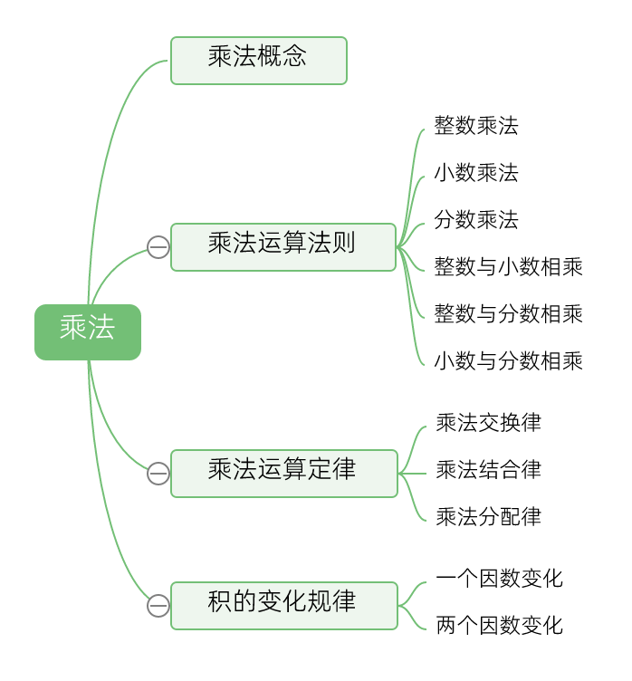

乘法
1. 乘法概念：求几个相同加数的和的简便运算。`因数×因数=积`

2. 乘法运算法则：
    * 整数乘法：
        * 数位对齐
        * 从个位乘起，依次用一位数去乘多位数的每一位
        * 哪一位上乘得的积满几十，就向前一位进几
        * 例如，234×5，先算 5×4=20，个位写 0 向十位进 2；再算 5×3=15，加上进位的 2 得 17，十位写 7 向百位进 1；最后算 5×2=10，加上进位的 1 得 11，百位写 1 千位写 1。所以 234×5=1170
    * 小数乘法：
        * 先按照整数乘法算出积
        * 看因数中一共有几位小数，就从积的右边起数出几位，点上小数点
        * 积的小数位数如果不够，在前面用 0 补足，再点小数点
        * 例如：3.2×2.5，先算 32×25=800，因数一共有两位小数，从积的右边起数两位点上小数点，所以 3.2×2.5=8
    * 分数乘法：
        * 分子相乘的积作分子，分母相乘的积作分母
        * 结果能约分的要约分，化为最简分数
        * 例如，2/3×3/4，分子 2×3=6，分母 3×4=12，所以 2/3×3/4=6/12=1/2
        * 对于带分数，将带分数化为假分数，再进行分数乘法运算
    * 整数与小数相乘：
        * 先按照整数乘法算出积
        * 看因数中有几位小数，就从积的右边起数出几位，点上小数点
        * 例如，4×1.25，先算 4×125=500，因数中有两位小数，从积的右边起数两位点上小数点，所以 4×1.25=5
    * 整数与分数相乘：
        * 整数与分子相乘的积作分子，分母不变
        * 结果能约分的要约分，化为最简分数
        * 例如，3×2/5，3×2=6，所以 3×2/5=6/5=1 又 1/5
        * 如果分数是带分数，带分数`m又n分之1`，实际上是`m + n分之一`，可以整数分别和带分数的整数部分，分数部分分别相乘。也可以带分数转换为假分数，再使用整数与分数相乘
    * 小数与分数相乘：
        * 将小数化为分数或者将分数化为小数，然后按照小数乘法或分数乘法的法则进行计算
        * 例如，0.5×3/4，将 0.5 化为 1/2，1/2×3/4=3/8

3. 乘法运算定律：
    * 乘法交换律：两个数相乘，交换因数的位置，积不变。用字母表示为 a×b = b×a。例如，3×4 = 4×3 = 12
    * 乘法结合律：三个数相乘，先把前两个数相乘，再和第三个数相乘，或者先把后两个数相乘，再和第一个数相乘，积不变。用字母表示为(a×b)×c = a×(b×c)。例如，(2×3)×4 = 2×(3×4) = 24
    * 乘法分配律：两个数的和与一个数相乘，可以先把它们分别与这个数相乘，再相加。用字母表示为(a + b)×c = a×c + b×c。例如，(2 + 3)×4 = 2×4 + 3×4 = 20

4. 积的变化规律：
    * 一个因数变化：一个因数不变，另一个因数扩大（或缩小）几倍，积也扩大（或缩小）相同的倍数，即`a×b = c，a×(b×m)=c×m，a×(b÷m)=c÷m`。例如，3×4=12，如果一个因数 3 不变，另一个因数 4 扩大 2 倍变为 8，此时积为 3×8=24，积扩大了 2 倍
    * 两个因数变化：一个因数乘一个非零数，另一个因数除以同一个数，积不变。例如，例如，4×6 = 24，如果一个因数 4 乘以 2 变为 8，另一个因数 6 除以 2 变为 3，此时积为 8×3 = 24，积不变

 
 
 

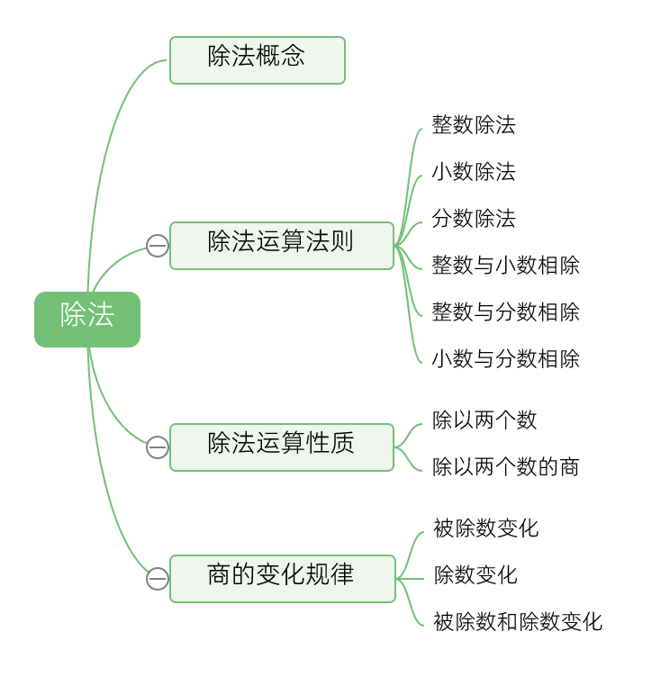

除法
1. 除法概念：已知两个因数的积与其中一个因数，求另一个因数的运算叫做除法。`被除数÷除数 = 商`
2. 除法运算法则：
    * 整数除法：
        * 从被除数的高位除起，先看除数有几位，再用除数试除被除数的前几位，如果它比除数小，再试除多一位数
        * 除到被除数的哪一位，就在那一位上面写上商
        * 每次除后余下的数必须比除数小
        * 例如，567÷21，先看除数 21 是两位数，用 21 试除被除数的前两位 56，商 2 余 14，再用 21 试除 147，商 7，正好除尽。所以 567÷21 = 27
    * 小数除法：
        * 先把除数的小数点去掉使它变成整数
        * 看除数原来有几位小数，就把被除数小数点向右移动相同的几位（位数不够时补 0）
        * 按照整数除法的法则进行计算
        * 商的小数点要和被除数的小数点对齐
        * 例如：5.67÷2.1，把除数 2.1 变成 21，被除数 5.67 变成 56.7，56.7÷21 = 2.7
    * 分数除法：
        * 除以一个分数等于乘以这个分数的倒数
        * 例如，2/3÷3/4 = 2/3×4/3 = 8/9
        * 整数除以分数：整数乘以分数的倒数。例如，3÷2/3 = 3×3/2 = 9/2 = 4 又 1/2
        * 带分数除法：先把带分数化为假分数，再按照分数除法的法则进行计算。例如，2 又 1/3÷3/4，2 又 1/3 = 7/3，7/3÷3/4 = 7/3×4/3 = 28/9 = 3 又 1/9
    * 整数与小数相除：
        * 把小数变为整数（即小数点向右移动相应位数），同时整数也相应扩大相同倍数，然后按照整数除法进行计算
        * 例如，5÷2.5，把 2.5 变为 25，5 变为 50，50÷25 = 2
    * 整数与分数相除：
        * 除以一个数，等于乘上这个数的倒数，转换成相应的乘法运算即可
        * 例如，5÷2/3 = 5×3/2 = 15/2 = 7 又 1/2
    * 小数与分数相除：
        * 将小数化为分数或者将分数化为小数，然后按照小数除法或分数除法的法则进行计算
        * 例如，1.5÷1/2，1.5 = 3/2，3/2÷1/2 = 3。又例如，2.75÷3/4，2.75 = 11/4，11/4÷3/4 = 11/3 = 3 又 2/3
3. 除法运算性质：
    * 除以两个数：一个数连续除以两个数，等于这个数除以这两个数的积。例如，100÷25÷4 = 100÷(25×4) = 1
    * 除以两个数的商：一个数除以两个数的商，等于这个数先除以商里的被除数，再乘以除数，即`a÷b = c，a÷(b÷c) = a÷b×c`。例如，100÷(20÷5) = 100÷20×5 = 25
4. 商的变化规律：
    * 被除数变化：被除数扩大（或缩小）几倍，除数不变，商也扩大（或缩小）相同的倍数。即`a÷b = c，(a×m)÷b = c×m，(a÷m)÷b = c÷m`。例如，12÷3 = 4，当被除数 12 扩大 2 倍变为 24 时，除数 3 不变，商为 24÷3 = 8，商扩大了 2 倍
    * 除数变化：被除数不变，除数扩大（或缩小）几倍，商反而缩小（或扩大）相同的倍数。即`a÷b = c，a÷(b×m)=c÷m，a÷(b÷m)=c×m`。例如，12÷3 = 4，当除数 3 扩大 2 倍变为 6 时，被除数 12 不变，商为 12÷6 = 2，商缩小了 2 倍
    * 被除数和除数变化：被除数和除数同时扩大（或缩小）相同的倍数，商不变。即`a÷b = c，(a×m)÷(b×m)=c，(a÷m)÷(b÷m)=c`。例如，12÷3 = 4，当被除数 12 和除数 3 都扩大 2 倍变为 24 和 6 时，商为 24÷6 = 4，商不变

[回到顶部](#小学数学)
  ⭐⭐⭐⭐⭐⭐⭐   

### 混合运算

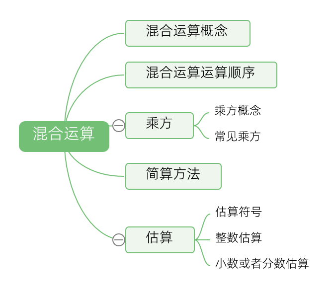

混合运算：
1. 混合运算概念：包括加、减、乘、除以及括号等多种运算符号组合在一起的数学运算式子的计算
2. 混合运算运算顺序：
    * 先算乘除，后算加减
    * 有括号时，先算括号内的运算
    * 同一级运算，从左到右依次进行
3. 乘方：
    * 乘方概念：n个相同因数相乘的运算，乘方的结果叫做幂。a^n中，a叫做底数，n叫做指数，读作`a的n次方`或“a的n次幂”
    * 常见乘方（两位数的乘法验证）
        * 1^2 2^2 ... 10^2 = 100
        * 11^2 = 121
        * 12^2 = 144
        * 13^2 = 169
        * 14^2= 196
        * 15^2 = 225
        * 16^2 = 256
        * 17^2 = 289
        * 18^2 = 324
        * 19^2 = 361
        * 20^2 = 400
        * 两位数的计算，可以使用，头乘头，尾成尾，中间是尾加尾，中间如果满10要进位到头部。例如，34×25 = 850
            * “头乘头”：3×2 = 6
            * “尾乘尾”：4×5 = 20
            * “中间是尾加尾”：4×2 + 3×5 = 8 + 15 = 23
            * 23 大于 10，向高位进位 2，所以最终结果为(6 + 2)在高位，3 在中间，0 在低位，即 34×25 = 850
4. 简算方法：通过运算定律，运算性质进行拆分，组合
5. 估算：
    * 估算符号：`≈`
    * 整数估算：把其中一个或者两个数看作接近整十或者整百的数
    * 小数或者分数估算：看作接近的整数

[回到顶部](#小学数学)
  ⭐⭐⭐⭐⭐⭐⭐   

## 常见的计量单位

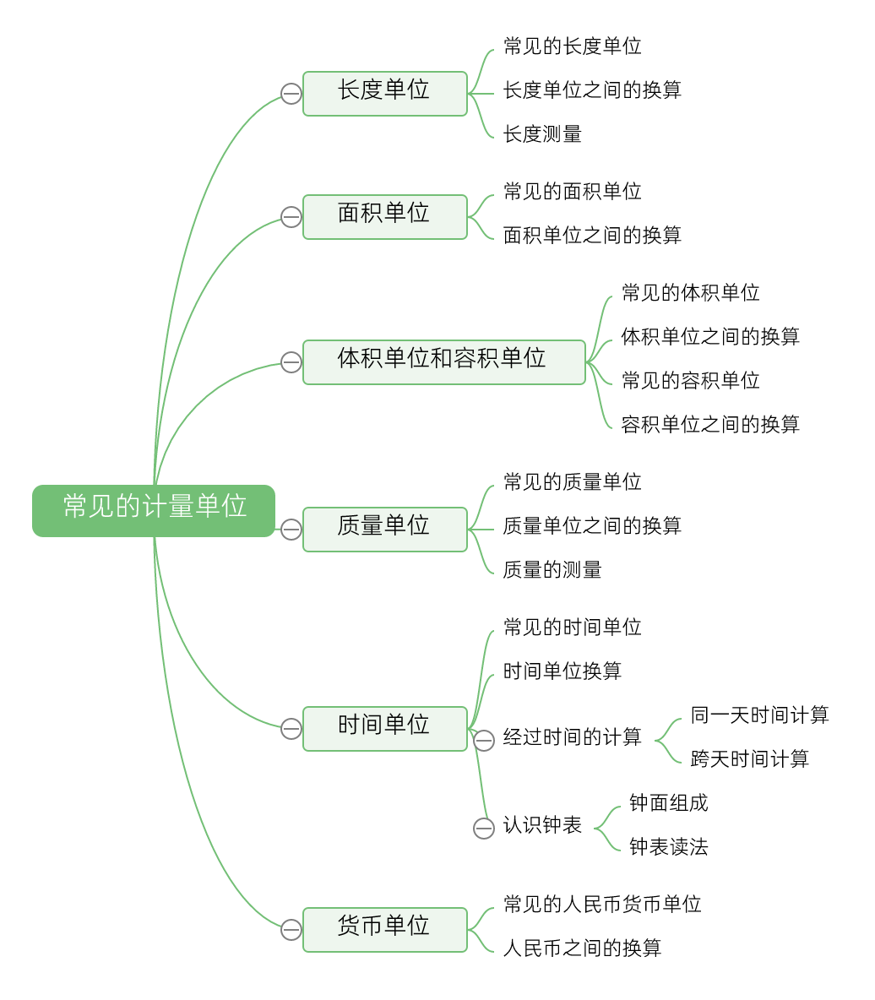

长度单位:
1. 常见的长度单位：毫米（mm）、厘米（cm）、分米（dm）、米（m）、千米（km）；千米又叫公里
2. 长度单位之间的换算：
    * 1 厘米 = 10 毫米，1 分米 = 10 厘米，1 米 = 10 分米，1 千米 = 1000 米，除了千米和米之间是1000进，其他相邻单位都是10进
    * 1公里 = 1 km（千米）
    * 1公里 = 1 km（千米） = 1000 m（米） = 1 0000 dm（分米） = 10 0000 cm（厘米） = 100 0000 mm（毫米）
3. 长度测量
    * 测量工具：使用直尺、卷尺等工具测量物体的长度
    * 测量方法：测量时要将物体的一端对准刻度 0，看物体的另一端对着刻度几，就是几厘米或几毫米等

 
 
 

面积单位
1. 常见的面积单位：有平方千米（km2），公顷（平方百米），平方米（m²），平方分米（dm²），平方厘米（cm²）、，
2. 面积单位之间的换算：长度单位换算的平方倍，如1公顷是1平方百米，换算成平方米，原来米和百米之间是100进制，平方倍之后就是10000进制，以下举例说明：
    * 1 平方千米 = 100 0000平方米
    * 1 公顷（平方百米） = 100 m * 100 m = 10000 m^
    * 1 平方米 = 100 平方分米，1 平方分米 = 100 平方厘米
    * 1 平方公里 = 1km^2(平方千米) = 1000000 m^2(平方米) = 1000000 00 平方分米 = 1000000 00 00 cm^2（平方厘米） = 1000000 00 00 00 mm^2（平方毫米）

    
    

 
 
 

体积单位和容积单位
1. 常见的体积单位：立方米（m³），立方分米（dm³），立方厘米（cm³）
2. 体积单位之间的换算：
    * 长度单位换算的立方倍
    * 1 立方米 = 1000 立方分米，1 立方分米 = 1000 立方厘米，相邻单位都是1000进
3. 常见的容积单位：升，毫升
4. 容积单位之间的换算：
    * 1L（升）=1dm^3(立方分米)，1ml (毫升) = 1cm3（立方厘米）
    * 1L = 1000毫升

 
 
 

质量单位
1. 常见的质量单位：克（g）、千克（kg）、吨（t）
2. 质量单位之间的换算
    *  1吨 = 1000 千克，1 千克 = 1000 克，相邻单位都是1000进制
    *  1 t（顿） = 1000 kg（千克）= 1000 000 g（克），
3. 质量的测量
    * 测量工具：使用天平、秤等工具测量物体的质量
    * 测量方法（略）

 
 
 
 

时间单位：
1. 常见的时间单位:
    * 世纪
    * 年、月、周，日
    * 时、分、秒
2. 时间单位换算
    * 1世纪 = 100年
    * 一年有 12 个月
    * 平年有 365 天，闰年有 366 天
    * 1周 = 7 天
    * 大月有 31 天，分别是 1、3、5、7、8、10、12 月；小月有 30 天，分别是 4、6、9、11 月；平年 2 月有 28 天，闰年 2 月有 29 天
    * 通常每 4 年里有一个闰年。判断闰年的方法能被 4 整除就是闰年，对于整百年能被 400 整除，能被 400 整除的是闰年
    * 一天有24小时
    * 1 时 = 60 分，1 分 = 60 秒
3. 经过时间的计算
    * 同一天时间计算：用结束时间减去开始时间。例如，上午 8 时到上午 10 时，经过的时间是 10 - 8 = 2（小时）
    * 跨天时间计算：先分别算出当天和第二天的经过时间，再相加。例如，第一天晚上 9 时到第二天早上 6 时，第一天晚上 9 时到 12 时经过了 12 - 9 = 3 小时，第二天从 0 时到早上 6 时经过了 6 小时，总共经过 3 + 6 = 9 小时
4. 认识钟表
    * 钟面组成：上有时针、分针和秒针，有 12 个数字；最短的是时针，秒针是最长最细的，分针在二者之间
    * 钟表读法：
        * 先读时，再读分。
        * 特殊的，分针指向 12，时针指向几就是几时，如，时针指向 3，分针指向 12，就是 3 时。
        * 特殊的，分针指向 6，时针在两个数字中间，时针过几就是几时半，例如，时针在 3 和 4 中间，分针指向 6，就是 3 时 30 分

 
 
 

货币单位
1. 常见的人民币货币单位（面值）：100 元、50 元、20 元、10 元、5 元、1 元、5 角、1 角等
2. 人民币之间的换算
    * 1 元 = 10 角，1 角 = 10 分，相邻单位是10进制
    * 1 元 = 10 角 = 100 分

   

[回到顶部](#小学数学)
  ⭐⭐⭐⭐⭐⭐⭐   

## 式与方程

用字母表示数：学会用字母表示数、数量关系、运算定律和计算公式等，体会用字母表示数的简洁性和一般性。
简易方程：初步认识方程的概念，学会解简单的方程，能够根据实际问题列方程并求解

式与方程：
1. 用字母表示数:
    * 作用：可以表示常见的数量关系、运算定律，运算性质和计算公式等。例如，用字母表示加法交换律 a + b = b + a；长方形的面积公式 S = ab（S 表示面积，a 表示长，b 表示宽）
    * 书写规则：
        * 数字与字母相乘
            * 数字与字母相乘时，乘号可以写成 “・” 或者省略不写，数字写在字母前面。如 3×a 可写成 3a
            * 当 1 与字母相乘时，1 可以省略不写。如 1×a 可写成 a
            * 带分数与字母相乘时，要把带分数化成假分数。如1又1/2 × a写成 3/2a
        * 字母与字母相乘
            * 乘号可以省略不写。如 a×b 可写成 ab
        * 含有字母的除法：
            * 一般按分数的写法来写。例如，`a÷b 写成 a/b （b≠0）`
        * 单位处理：含有字母的式子中，式子后面有单位，一般将式子要用括号括起来，再写单位。比如，`(a + b) 米`

2. 方程的概念：含有未知数的等式叫做方程。方程必须是等式，必须含有未知数。例如，2x + 5 = 17，其中 x 是未知数，这个式子既是等式又含有未知数，所以是方程
3. 等式性质
        * 等式的性质一：等式两边同时加上或减去同一个数，等式仍然成立
        * 等式的性质二：等式两边同时乘或除以同一个不为 0 的数，等式仍然成立
4. 方程的解：使得方程两边相等的未知数的值
5. 解方程：
    * 解方程前先写`解`
    * 依据等式的性质，求方程的解
    * 一行一个方程，未知数放左边，等号对齐
    * 将求得的未知数的值代入原方程进行检验
    * 例如，解方程 3x - 6 = 12，第一步，两边同时加上 6，得到 3x - 6 + 6 = 12 + 6，即 3x = 18，第二步，两边同时除以 3，得到 3x÷3 = 18÷3，解得 x = 6
6. 列方程解决问题：
    * 根据实际问题中的数量关系，找出等量关系
    * 建立方程（有未知数的等式）
    * 解方程求未知数
    * 检验并写出回答

[回到顶部](#小学数学)
  ⭐⭐⭐⭐⭐⭐⭐   

## 比和比例

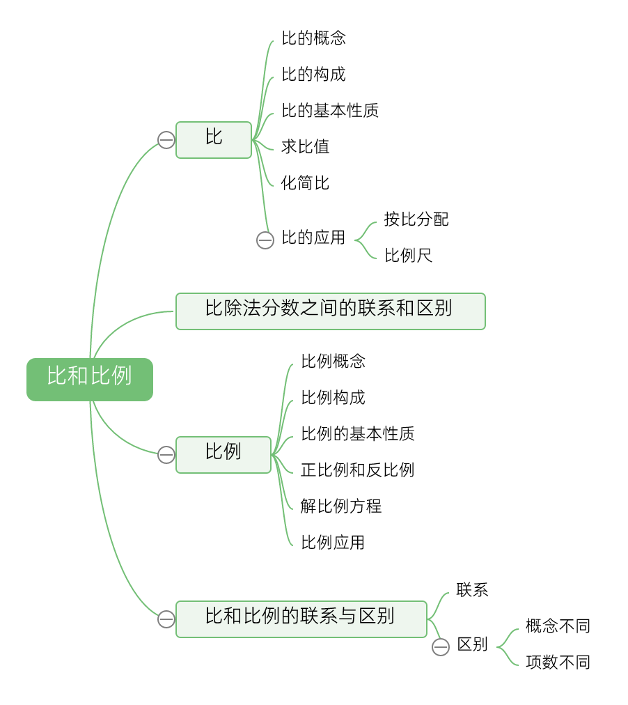

比：
1. 比的概念：两个数相除又叫做两个数的比
2. 比的构成：前项:后项 = 比值（比的后不能是0）
3. 比的基本性质：比的前项和后项同时乘或除以相同的数（0 除外），比值不变
4. 求比值：就是用比的前项除以后项所得的结果
5. 化简比：根据比的性质将两个数的比化为最简的整数比，即前项和后项互质
6. 比的应用
    * 按比分配
    * 比例尺：`图上距离：实际距离 = 比例尺`。例如，例如：一幅地图的比例尺是 1:5000，表示图上 1 厘米代表实际距离 5000 厘米

 
 
 

比除法分数之间的联系和区别:

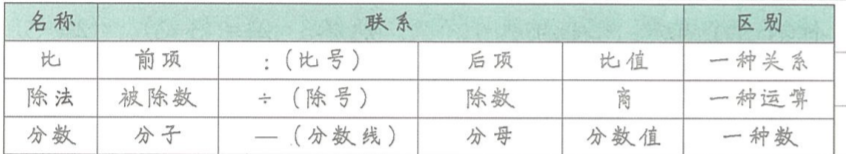

 
 
 

比例：
1. 比例概念：表示两个比相等的式子叫做比例。例如 3:4 = 6:8
2. 比例构成：
    * 组成比例的四个数，叫做比例的项
    * 两端的两项叫做比例的外项
    * 中间的两项叫做比例的内项
    * 例如，在 3:4 = 6:8 中，3 和 8 是外项，4 和 6 是内项
3. 比例的基本性质：两个内项的积等于两个外项的积。例如，在 3:4 = 6:8 中，3×8 = 4×6 = 24
  
4. 正比例和反比例
    * 正比例：` x/y = k（一定）`，两个相关联的量，一种量变化，另外一种量也随之变化，这两个量之间的比值（商）一定，这两种量就叫做成正比例的量。例如，速度一定时，路程和时间成正比例关系
    * 反比例：`xy = k（一定）`，两种相关联的量，一种量变化，另一种量也随着变化，如果这两种量中相对应的两个数的积一定，这两种量就叫做成反比例的量。例如，当总面积一定时，长方形的长和宽成反比例关系，因为长 × 宽 = 面积
    * 判断正反比例方法：这两个量是相关联的，一种量变化，另外一种量也随之变化，根据商一定，还是积一定判断正反比例，商一定就是正比例，积一定就是反比例

5. 解比例方程：
    * 比例方程通常是：a:b = c:d 或者 a/b = c/d的等式，其中a，d是外项，b，c是内向
    * 先写解
    * 根据比例的基本性质，求比例中的未知项
    * 每行一个方程，未知数放左边，等号对齐
    * 将求得的未知数的值代入原比例方程进行检验
    * 例如，解比例方程 2:x = 4:6，根据比例性质有 4x = 12，两边同时除以4，得到 x = 3

6. 比例应用：
    * 根据实际问题的数量关系，找出等量关系
    * 建立比例方程
    * 解方程求未知数
    * 检验并回答
    

 
 
 

比和比例的联系与区别
1. 联系：比是比例的基础。比例是由两个比值相等的比组成的
2. 区别：
    * 概念不同：比是两个数相除的关系；比例是表示两个比相等的式子
    * 项数不同：比由两项组成，前项和后项；比例由四项组成，两个内项和两个外项

[回到顶部](#小学数学)
  ⭐⭐⭐⭐⭐⭐⭐   

## 空间与图形

[回到顶部](#小学数学)
  ⭐⭐⭐⭐⭐⭐⭐   

### 线

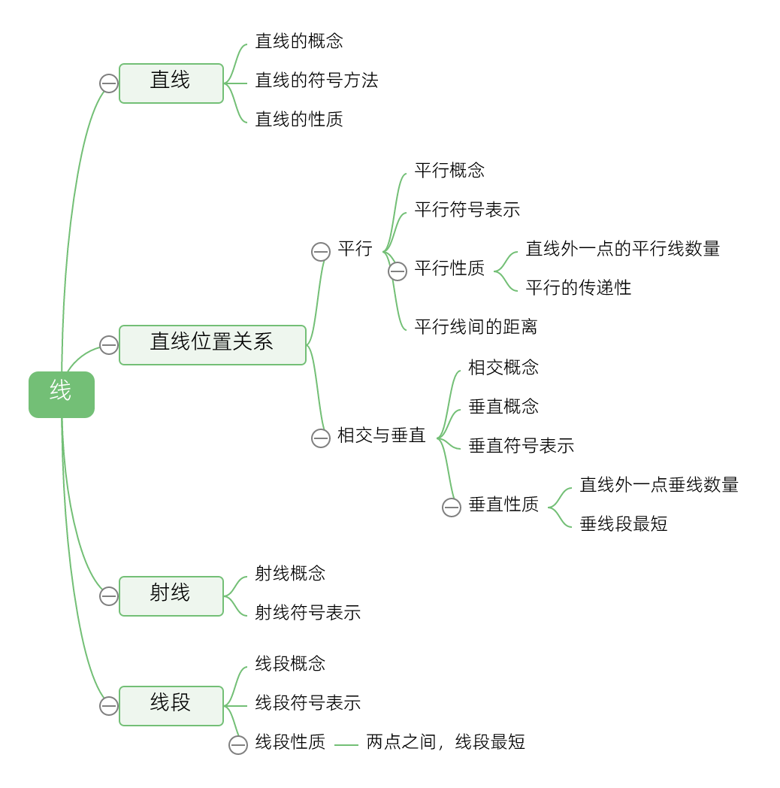

**直线**
1. 直线的概念：向两端无限延伸，没有端点的线
2. 直线的符号方法：通常用直线上的两个点的大写字母来表示一条直线，如直线 AB，或者一个点的小写字母，如直线a
3. 直线的性质：经过两点有且只有一条直线（两点确定一条直线）

 
 
 

**直线位置关系**

1. 平行
    * 平行概念：在同一平面内，不相交的两条直线叫做平行线。（注意同一个平面的前提）
    * 平行符号表示：直线 a 平行于直线 b ，记作`a // b`
    * 平行性质：
        * 直线外一点的平行线数量；经过直线外一点，有且只有一条直线与已知直线平行；
        * 平行的传递性：如果两条直线都与第三条直线平行，那么这两条直线也互相平行
    * 平行线间的距离：
        * 在直线上任取一点，向另外一个直线作垂线，两条平行线之间的垂线段的长度，就是平行线的距离；
        * 任意一条直线上的点到另一条直线的距离处处相等

2. 相交与垂直
    * 相交概念：两条直线在同一平面内有一个公共点时，就称这两条直线相交。这个公共点叫做交点
    * 垂直概念：如果两条直线相交成直角，就说这两条直线互相垂直，其中一条直线叫做另一条直线的垂线，这两条直线的交点叫做垂足
    * 垂直符号表示：通常用符号 “⊥” 来表示垂直。例如，直线 a 垂直于直线 b，可以记作 a⊥b：
    * 垂直性质
        * 直线外一点垂线数量：的同一平面内，过直线上或者直线外一点，有且只有一条直线与已知直线垂直
        * 垂线段最短：直线外的一点到直线的的线段中，垂线段最短（这个垂线段的长度也叫点到直线的距离）

 
 
 

**射线**
1. 射线概念：由线段的一端无限延长所形成的直的线
2. 射线符号表示：可以用端点和射线上另一点来表示射线。例如，以点 A 为端点的射线，可以记作射线 AB。这里要注意，射线 AB 和射线 BA 是不同的射线，因为射线具有方向性

 
 
 

**线段**
1. 线段概念：直线上两点间的有限部分。线段有两个端点，这两个端点确定了线段的长度和位置
2. 线段符号表示：可以用两个大写字母来表示线段，例如线段 AB，表示以 A、B 两点为端点的线段。也可以用一个小写字母来表示，如线段 a
3. 线段性质：两点之间，线段最短

[回到顶部](#小学数学)
  ⭐⭐⭐⭐⭐⭐⭐   

### 角

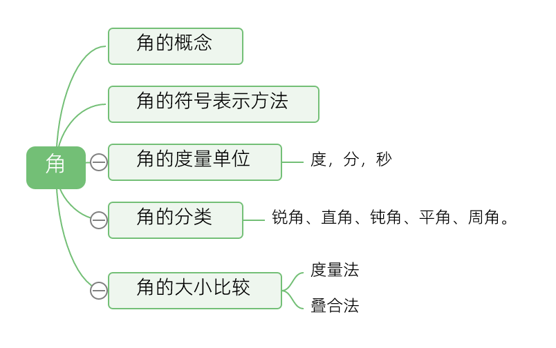

1. 角的概念：由一个公共端点引出两条射线组成的图形，两条射线叫做角的边，点叫做角的顶点
2. 角的符号表示方法
    * 用三个大写字母表示：如∠AOB，O 是顶点，A、B 分别是两条边上的点
    * 用一个大写字母表示：当以这个字母为顶点的角只有一个时，可以用这个字母表示角，如∠O
    * 用数字或希腊字母表示：在角的内部标上数字或希腊字母，如∠1、∠α
3. 角的度量单位：
    * 度：记作`°`，把一个圆平均分成 360 份，每一份所对的角的大小是 1 度，记作 `1°`
    * 分：记作`′`, 1° = 60′ 
    * 秒：记作`″`，1′ = 60″
4. 角的分类
    * 锐角：大于 0° 小于 90° 的角
    * 直角：等于 90° 的角
    * 钝角：大于 90° 小于 180° 的角
    * 平角：等于 180° 的角
    * 周角：等于 360° 的角
5. 角的大小比较：
    * 度量法：用量角器量出角的度数，比较度数的大小
    * 叠合法：把两个角的顶点和一条边重合，比较另一条边的位置关系，从而确定角的大小

[回到顶部](#小学数学)
  ⭐⭐⭐⭐⭐⭐⭐   

### 平面图形

  ⭐⭐⭐⭐⭐⭐⭐   

#### 三角形

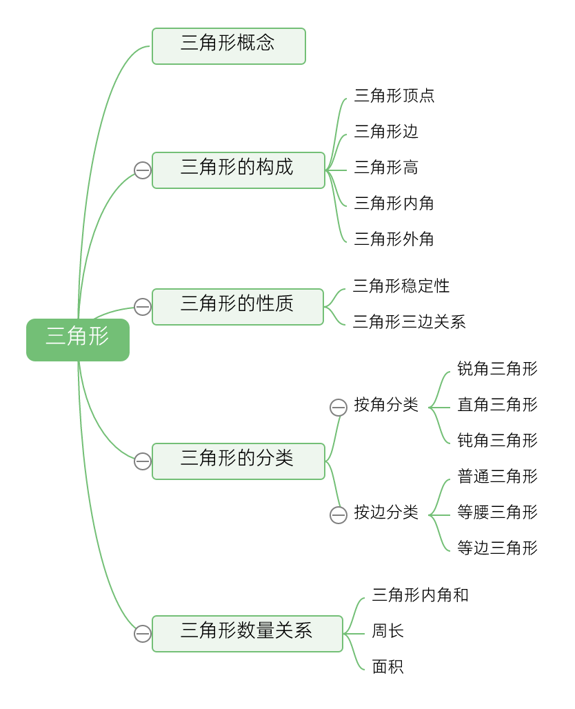

1. 三角形概念：同一平面内，不在一条直线上的三条线段，首尾连接形成的的图形
2. 三角形的构成：
    * 三角形顶点：线段的交点
    * 三角形边：组成三角形的线段
    * 三角形高：三角形任意一顶点，向对边或者对边的延长线作垂线，顶点到垂足的线段叫做三角形的高
    * 三角形内角：边的夹角，叫做三角形内角，三角形的内角和是180°
    * 三角形外角：三角形的一边与另一边的延长线组成的角叫做三角形的外角。三角形的外角等于与它不相邻的两个内角的和
3. 三角形的性质：
    * 三角形稳定性：三角形具有稳定性
    * 三角形三边关系：任意两边之和大于第三边，任意两边之差小于第三边， 即`a+b > c , a-b < c`
4. 三角形的分类：
    * 按角分类：
        * 锐角三角形：三个角都是锐角（小于 90°）的三角形
        * 直角三角形：有一个角是直角（等于 90°）的三角形。直角三角形的两条直角边相互垂直
        * 钝角三角形：一个角是钝角（大于 90° 小于 180°）的三角形
    * 按边分类：
        * 普通三角形：三条边不相等
        * 等腰三角形：有两条边相等的三角形。相等的两条边叫做腰，另一条边叫做底。等腰三角形的两个底角相等
        * 等边三角形（正三角形）：三条边都相等的三角形。等边三角形的三个角也相等，都是 60°
5. 三角形数量关系：
    * 三角形内角和为 180°
    * 周长：C = 三边之和，即 C = a + b + c，其中 a、b、c 分别为三角形的三条边
    * 面积：S = 1/2×底×高，即 S = 1/2ah，a 为底，h 为这条底边对应的高

[回到顶部](#小学数学)
  ⭐⭐⭐⭐⭐⭐⭐   

#### 四边形
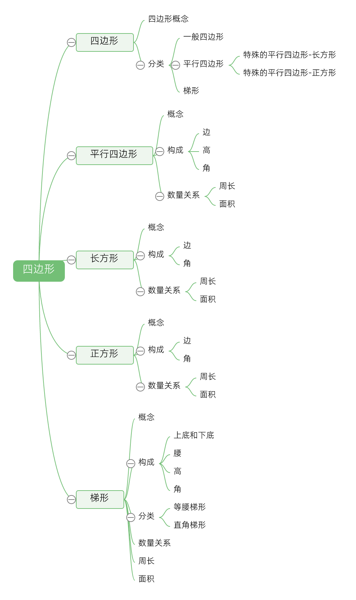

**四边形**
1. 四边形的概念：同一个平面内，不在同一条直线上的四条线段首尾连接形成的平面图形，任意四边形的内角和是360°
2. 四边形分类：
    * 一般四边形
    * 平行四边形
        * 特殊的平行四边形-长方形
        * 特殊的平行四边形-正方形 
    * 梯形 

 
 
 

**平行四边形**
1. 平行四边形的概念：两组对边分别平行的四边形是平行四边形
2. 平行四边形的构成
    * 平行四边形的边：平行四边形有两组对边，分别平行且相等
    * 平行四边形的高：平行四边形的一条边上的一点向对边作的垂线段，叫做平行四边形的高
    * 平行四边形的角：对角相等，邻角互补
3. 数量关系：
    * 周长：C = 2×（底 + 邻边）= 2(a + b)，其中，底为 a，邻边为 b
    * 面积：S = 底×高 = ah，其中，a 为底，h 为高

 
 
 

**特殊的平行四边形-长方形**
1. 长方形的概念：有一个角为直角的平行四边形，叫做长方形。长方形是特殊的平行四边形。对边相等，四个角都是直角
2. 长方形的构成：
    * 长方形的边：有两组对边，分别平行且相等
    * 长方形的角：长方形的四个角都是直角，即 90°
3. 数量关系：
    * 周长：C = 2×（长 + 宽）= 2(a + b)，其中 a 为长，b 为宽
    * 面积：S = 长×宽 = ab，a 为长，b 为宽

 
 
 

**特殊的平行四边形-正方形**
1. 正方形的概念：一个角是直角，四条边都相等的平行四边形，叫做正方形；或者四条边相等，四个角都是直角的四边形
2. 正方形构成：
    * 正方形的边：四条边都相等
    * 正方形的角：正方形的四个角都是直角，即 90°
3. 数量关系：
    * 周长：C = 4×边长 = 4a，a 为边长
    * 面积：S = 边长×边长 = a^2，a 为边长
        

 
 
 

**梯形**
1. 梯形的概念：只有一组对边平行的四边形
2. 梯形构成：
    * 梯形的上底和下底：平行的两条边叫做梯形的底，其中较短的底叫上底，较长的底叫下底
    * 梯形的腰：不平行的两条边叫做腰
    * 梯形的高：两底之间的垂线段叫做梯形的高
    * 梯形的角：梯形的内角和为 360°。梯形同一腰上的两个角互补
3. 梯形分类
    * 等腰梯形：两腰相等的梯形，同一底边的夹角也相等
    * 直角梯形：直角梯形有两个直角，直角边的腰就是梯形的高
4. 数量关系：
    * 周长：C = 上底 + 下底 + 两腰长度之和，若上底为 a，下底为 b，两腰分别为 c、d，则 C = a + b + c + d
    * 面积：S = 1/2 ×（上底 + 下底）× 高 = 1/2(a + b)h，a 为上底，b 为下底，h 为高

[回到顶部](#小学数学)
  ⭐⭐⭐⭐⭐⭐⭐   

#### 圆 
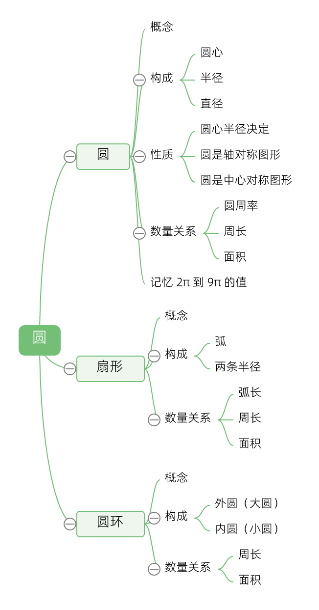

1. 圆的概念：在一个平面内，围绕一个点并以一定长度为距离旋转一周所形成的封闭曲线叫做圆

2. 圆的构成：
    * 圆的圆心：确定圆的位置，通常用字母“O”表示
    * 圆的半径：连接圆心和圆上任意一点的线段，用字母“r”表示
    * 圆的直径：通过圆心并且两端都在圆上的线段，用字母“d”表示，且 d = 2r

3. 圆的性质：
    * 圆心半径决定：圆心决定圆的位置，半径决定圆的大小
    * 圆是轴对称图形：其对称轴是圆的任意直径
    * 圆是中心对称图形：其对称中心是圆心

4. 圆的数量关系
    * 圆周率： Π≈3.14，通常取3.14
    * 周长：C = πd = 2πr ，其中 π 是圆周率，d 是直径，r 是半径
    * 面积：S = πr²，其中 π 是圆周率，r 是半径

5. 记忆2π到9π的值（为了方便计算）：
    * 1×3.14 = 3.14
    * 2×3.14 = 6.28
    * 3×3.14 = 9.42
    * 4×3.14 = 12.56
    * 5×3.14 = 15.7
    * 6×3.14 = 18.84
    * 7×3.14 = 21.98（7之间，整数和整数相乘，小数和小数相乘就可以了，之后小数要进位到整数）
    * 8×3.14 = 25.12
    * 9×3.14 = 28.26

 
 
 

**扇形**
1. 扇形概念：一条弧和经过这条弧两端的两条半径所围成的图形叫扇形
2. 扇形构成：
    * 扇形的弧：圆上任意两点间的部分叫做圆弧，简称弧
    * 扇形的两条半径
3. 扇形数量关系：
    * 弧长：L = nπr/180，其中 n 是圆心角的度数，π是圆周率，r 是半径，基础公式是从`n/360×2πr`推理过来的
    * 周长：C = 2r + L = 2r + nπr/180，其中 n 是圆心角的度数，π是圆周率，r 是半径
    * 面积公式：S = nπr²/360 = 1/2 × nπr/180 × r = 1/2lr，其中，n 是圆心角的度数，π是圆周率，r 是半径，l 是弧长，基础公式是从`n/360×πr²`推理过来的

 
 
 

**圆环**
1. 圆环概念：以同一圆心的两个半径不相等的圆，大圆和小圆之间的部分
2. 圆环构成：
    * 圆环的外圆（大圆）：半径较大的圆，半径用R表示
    * 圆环的内圆（小圆）：半径较小的圆，半径用r表示
3. 圆环数量关系
    * 周长：C = 外圆周长 + 内圆周长 = 2πR + 2πr，其中 π 是圆周率，R 为外圆半径，r 为内圆半径
    * 面积：S = 外圆面积 - 内圆面积 = πR² - πr² = π（R² - r²），其中 π 是圆周率，R 为外圆半径，r 为内圆半径

[回到顶部](#小学数学)
  ⭐⭐⭐⭐⭐⭐⭐   

### 立体图形

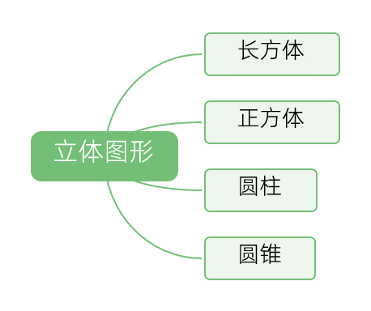

  ⭐⭐⭐⭐⭐⭐⭐   

#### 长方体
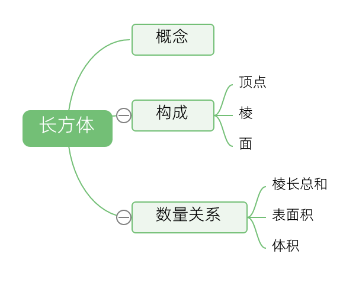

1. 长方体的概念：六个长方形围成的立体图形

2. 长方体的构成：
    * 长方体顶点：有 8 个顶点，每个顶点连接3条棱
    * 长方体棱：有 12 条棱，相对的棱长度相等
    * 长方体面：有 6 个面，每个面都是长方形，相对的面完全相同
   
3. 长方体数量关系：
    * 棱长总和：C =（长 + 宽 + 高）× 4 = 4(a + b + h)，其中 a 为长，b 为宽，h 为高
    * 表面积：S = 2×(长 × 宽 + 长 × 高 + 宽 × 高) = 2(ab + ah + bh)，其中 a 为长，b 为宽，h 为高
    * 体积：V = 长 × 宽 × 高 = abh，其中 a 为长，b 为宽，h 为高

[回到顶部](#小学数学)
  ⭐⭐⭐⭐⭐⭐⭐   

#### 正方体

1. 正方体概念：又称立方体，六个正方形围成的立体图形

2. 正方体构成：
    * 正方体顶点：有 8 个顶点，每个顶点连接三条棱
    * 正方体棱：有 12 条棱，每条棱的长度都相等
    * 正方体面：有 6 个面，每个面都是正方形，且面积都相等
3. 正方体数量关系
    * 棱长总和：C = 棱长 × 12 = 12a，其中 a 为棱长
    * 表面积：S = 6 × 边长 × 边长 = 6a²，其中 a 为边长
    * 体积：V = 边长 × 边长 × 边长 = a³，其中 a 为边长
 

[回到顶部](#小学数学)
  ⭐⭐⭐⭐⭐⭐⭐   

#### 圆柱
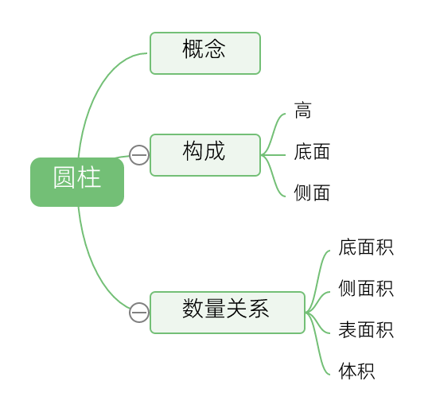

1. 圆柱的概念：以矩形的一边所在直线为旋转轴，旋转一周得到的立体图形
2. 圆柱的构成：
    * 圆柱的高：圆柱有无数条高，且所有的高都相等
    * 圆柱的底面：圆柱的两个圆面叫底面，底面是上下两个相同的圆
    * 圆柱的侧面：侧面是一个曲面，展开是一个长方形或者正方形，当圆柱的底面周长和高相等时，侧面展开图是正方形
3. 圆柱的数量关系
    * 底面积：S底 = π× 半径 ² = πr²，其中 π 是圆周率，r 是底面半径，
    * 侧面积：S侧 = 底面圆周长 × 高 = 2πrh，其中 π 是圆周率，r 是底面半径，h 为高，推理基础是圆柱侧面是一个长方形，
    * 表面积: S = 侧面积 + 2 × 底面积 = 2πrh + 2πr²，其中 π 是圆周率，r 是底面半径，h 为高
    * 体积：V = 底面积 × 高 = πrh²，其中 π 是圆周率，r 是底面半径，h 为高

[回到顶部](#小学数学)
  ⭐⭐⭐⭐⭐⭐⭐   

#### 圆锥
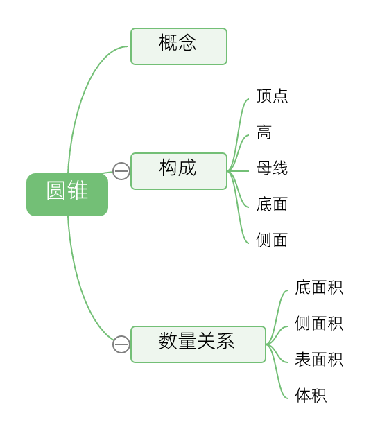

1. 圆锥的概念：以直角三角形的一条直角边为旋转轴，旋转一周所成的曲面所围成的立体图形 
2. 圆锥的构成：
    * 圆锥的顶点：圆锥只有一个顶点，沿着顶点向底面切开截面是等腰三角形
    * 圆锥的高：圆锥只有一条高，从圆锥的顶点到底面圆心的距离是圆锥的高
    * 圆锥的母线：圆锥侧面展开图扇形的半径叫做圆锥的母线
    * 圆锥的底面：底面是一个圆
    * 圆锥的侧面：侧面是一个曲面，展开图是一个扇形
3. 圆锥的数量关系
    * 圆锥的底面积：S底 = πr²，，其中 π 是圆周率，r 是底面半径
    * 圆锥的侧面积：S侧 = πrl，其中 r 是底面半径，l 是圆锥母线长，推理基础是圆锥侧面展开是一个扇形，`S扇形 = 1/2 × 扇形弧长（这里是底面周长） × 扇形半径（这里是圆锥的母线） = 1/2 × 2πr × l = πrl`
    * 圆锥的表面积：S = 侧面积 + 底面积 = πrl + πr²，其中 π 是圆周率，r 是底面半径，L 是圆锥母线长
    * 圆锥的体积：V = 1/3 × 底面积 × 高 = 1/3πr²h，其中 π 是圆周率，r 为底面半径，h 为高

[回到顶部](#小学数学)
  ⭐⭐⭐⭐⭐⭐⭐   

### 图形的位置
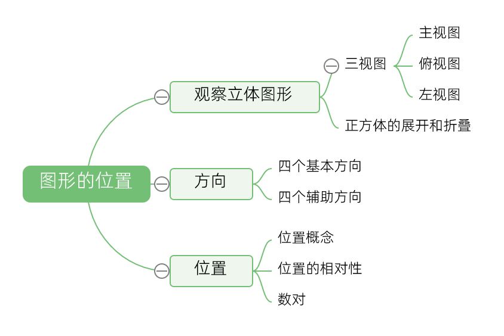

**观察立体图形**
1. 三视图：从物体的正面，左面，上面三个方向观看立体图形，可以得到描述这个立体图形的三个平面图形，即三视图
    * 主视图：从物体的前面向后面投射所得的视图
    * 俯视图：从物体的上面向下面投射所得的视图
    * 左视图：从物体的左面向右面投射所得的视图

2. 正方体的展开和折叠：
    * “1-4-1”型：6种
    * “2-3-1”型：3种
    * “2-2-2”型：1种
    * “3-3”型：1种

 
 
 

**方向**
1. 四个基本方向：东南西北，地图通常是按上北下南，左西右东绘制
2. 四个辅助方向：
    * 东北，西北，东南，西南
    * 角度描述：东北方向也可以描述为北偏东45度，习惯上从南北开始描述方向，就是角度是靠近南北方向计算的，例如东偏南30°应该描述为南偏东60°

 
 
 

**位置**
1. 位置概念：物体在空间中所处的方位和地点
2. 位置的相对性：确定物体空间位置，首先要确定参考物体，使用上下左右前后方位词描述
3. 数对：在一个平面中，可用数对`（列数，行数）`确定物体位置，通常数对第一个数字叫做列，第二个数字叫做行。在平面直角坐标系中，任意一点的位置都可以用一个数对来表示

[回到顶部](#小学数学)
  ⭐⭐⭐⭐⭐⭐⭐   

### 图形的变换

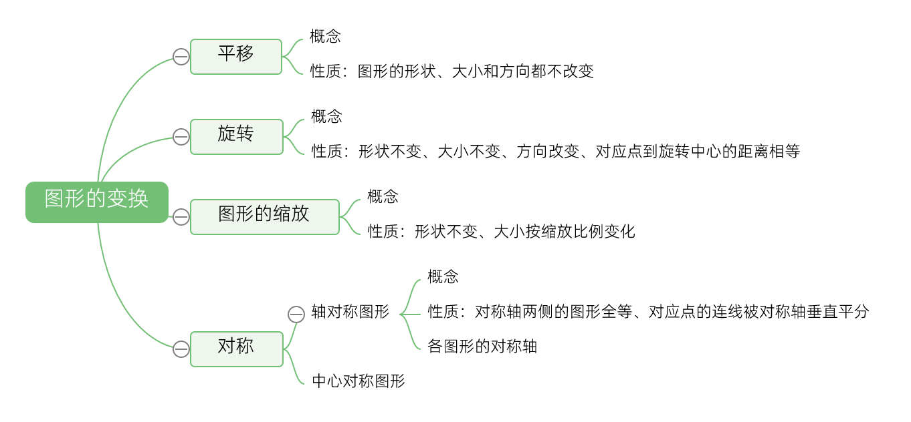

**平移**
1. 平移的概念：图形沿着某个方向移动一定的距离
2. 平移的性质：图形的形状、大小和方向都不改变
   
 
 
 

**旋转**
1. 旋转的概念：图形围绕一个固定点旋转一个方向或者角度，这个固定点叫做旋转中心
2. 旋转的性质：
    * 形状：图形的形状不变
    * 大小：大小不变
    * 方向：方向改变，对应点与旋转中心连线所成的角都等于旋转角
    * 对应点到旋转中心的距离相等

 
 
 

**图形的缩放**
1. 图形缩放的概念：图形各边按照一定比例放大缩小，得到图形的放大图或者缩小图
2. 图形缩放的性质：
    * 形状：不变
    * 大小：按缩放比例变化。例如，一个图形的边长放大为原来的 2 倍，那么它的面积会变为原来的 4 倍；如果边长缩小为原来的 1/2，面积则变为原来的 1/4

 
 
 

**对称**
1. 轴对称图形：
    * 轴对称图形概念：一个图形沿着一条直线对折后，直线两侧的部分能够完全重合，这个图形就是轴对称图形，这条直线叫做对称轴
    * 轴对称图形性质
        * 对称轴两侧的图形全等
        * 对应点的连线被对称轴垂直平分
    * 各图形的对称轴：
        * 等腰三角形：1条
        * 等边三角形：3条
        * 长方形：2条
        * 正方形：4条（多了两条对角的）
        * 等腰梯形：1条
        * 圆：无数条
2. 中心对称图形：一个图形围绕一个点旋转180度，与原来图形重合，叫做中心对称图形，这个点是对称中心，如正方形和圆

 
 
 

[回到顶部](#小学数学)
  ⭐⭐⭐⭐⭐⭐⭐   

## 统计与概率

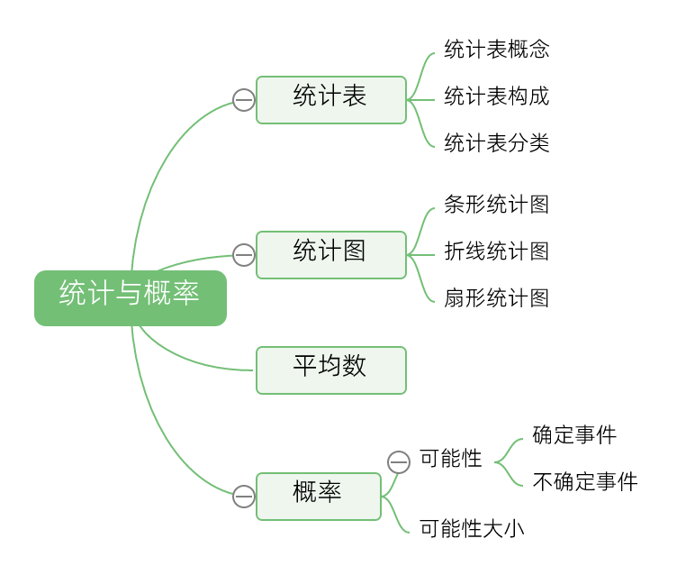

统计表
1. 统计表概念：把收集到的数据整理后制成表格，用来反映情况、说明问题，这样的表格就叫做统计表
2. 统计表构成：
    * 表格外：标题，单位说明，制表日期，备注
    * 表格内：
        * 横标目：通常在统计表的上方，从横向角度对表格内容进行分类说明，横标目决定了表格每一行数据的性质
        * 纵标目：在统计表的左侧，纵标目是从纵向角度对表格内容进行分类说明，纵标目决定了表格每一列数据的性质
        * 数据：填写在表格中的具体数字信息，是统计表的核心内容。它反映了各个项目的具体数值情况

        | 项目          | 苹果 | 香蕉 | 橘子 | 草莓 |
        | ------------- | ---- | ---- | ---- | ---- |
        | 数量（个）    | 10   | 15   | 8    | 12   |
        | 价格（元/个） | 3    | 2    | 4    | 5    |
        * 这里有“数量（个）”和“价格（元/个）”两个横标目，例如，“数量（个）”这个横标目说明下面每一行对应的是不同水果的数量信息
        * 这里有“苹果”“香蕉”“橘子”“草莓”等纵标目，这些纵标目说明了每一列数据对应的是哪种水果

3. 统计表分类：
    * 单式统计表：一个统计项目。例如，只统计一个班级学生的语文成绩，这样的统计表就是单式统计表
    * 复式统计表：两个或者两个以上统计项目。同时统计一个班级学生的语文成绩和数学成绩，这种统计表就是复式统计表

 
 
 

统计图
1. 统计图概念：用点、线、面、体等绘制成的几何图形，用以表示各种数量间的关系及其变动情况的工具
2. 统计图分类：
    * 条形统计图: 
        * 用直条的长短表示数量的多少
        * 适用场景：比较不同类别数据的具体数值大小
        * 例如，统计不同班级的人数，可以用条形统计图，能清楚地看出哪个班级人数多，哪个班级人数少
    * 折线统计图：
        * 用折线的起伏表示数量的增减变化情况
        * 适用场景：展示数据随时间或其他有序变量的变化趋势
        * 例如：记录股票价格在一段时间内的变化，用折线统计图可以清晰地看出价格的波动趋势
    * 扇形统计图
        * 用整个圆表示总数，圆内各个扇形的大小表示各部分数量占总数的百分比
        * 适用场景：表示部分与整体的关系，以及各部分在总体中所占的比例
        * 例如：统计一个学校不同兴趣小组的人数占总人数的比例，用扇形统计图可以直观地看出各个兴趣小组的占比情况

 
 
 

平均数：`平均数 = 数据总和 ÷ 数据个数`，即平均数等于数据的和除以数据的个数，表示数据集中程度（平均水平）的统计特征量，容易受极端数据影响，为了避免极端数据影响，有些比赛中，会去掉一个最高分，去掉一个最低分再计算平均数

 
 
 

概率
1. 可能性
    * 确定事件
        * 必然发生，必然不发生
        * 描述词：一定，不可能
    * 不确定事件：
        * 时而发生，时而不发生
        * 描述词：可能
2. 可能性大小：概率是表示一个事件发生的可能性大小的数，`P(A) = m/n`中，m 表示事件 A 发生的次数或者满足事件 A 的情况数，n 表示所有可能的结果总数

[回到顶部](#小学数学)
  ⭐⭐⭐⭐⭐⭐⭐   

## 综合应用

掌握分析问题、找出数量关系、列方程求解等解题方法

  ⭐⭐⭐⭐⭐⭐⭐   

### 基本数量关系

1. 简单数量关系：
    * 和关系：两个或多个数相加得到和。例如，已知两个数分别为 a 和 b，则它们的和为 a + b。比如，3 和 5 的和是 3 + 5 = 8。
    * 差关系：两个数相减得到差。若有两个数 a 和 b，那么差为 a - b。例如，8 和 5 的差是 8 - 5 = 3。
    * 积关系：两个或多个数相乘得到积。对于两个数 a 和 b，积为 a×b。比如，4 和 3 的积是 4×3 = 12。
    * 商关系：两个数相除得到商。设两个数为 a 和 b（b≠0），商为 a÷b。分数关系中，a/b 也表示商的关系。比如，8 和 4 的商是 8÷4 = 2，3:4 = 3÷4 = 3/4。

2. 和差问题：
    * 已知两个数的和与差，求这两个数。
    * 公式为：大数 = （和 + 差）÷2；小数 = （和 - 差）÷2。
    * 例如，两数之和为 15，两数之差为 3，那么大数为(15 + 3)÷2 = 9，小数为(15 - 3)÷2 = 6。

3. 和倍问题：
    * 已知两个数的和以及它们之间的倍数关系，求这两个数。
    * 公式为：小数 = 和÷（倍数 + 1）；大数 = 小数×倍数。
    * 例如，两数之和为 36，大数是小数的 3 倍，那么小数为 36÷(3 + 1) = 9，大数为 9×3 = 27。

4. 差倍问题：
    * 已知两个数的差以及它们之间的倍数关系，求这两个数。
    * 公式为：小数 = 差÷（倍数 - 1）；大数 = 小数×倍数。
    * 例如，两数之差为 24，大数是小数的 4 倍，那么小数为 24÷(4 - 1) = 8，大数为 8×4 = 32。

5. 公因数问题：
    * 几个数公有的因数叫做这几个数的公因数。
    * 例如，12 的因数有 1、2、3、4、6、12，18 的因数有 1、2、3、6、9、18，那么 12 和 18 的公因数有 1、2、3、6。最大公因数是公因数中最大的一个
    * 图形分割等问题中，也会用到最大公因数。比如要把一个长方形纸分成若干个边长相等的小正方形，且没有剩余，小正方形的边长就是长方形长和宽的最大公因数

6. 公倍数问题：
    * 几个数公有的倍数叫做这几个数的公倍数。
    * 例如，3 的倍数有 3、6、9、12、15、18……，4 的倍数有 4、8、12、16、20……，所以 3 和 4 的公倍数有 12、24、36……。最小公倍数是公倍数中最小的一个
    * 在安排工作、循环周期等问题中会用到最小公倍数。比如，甲每 3 天去一次图书馆，乙每 4 天去一次图书馆，他们下一次同时去图书馆的时间间隔就是 3 和 4 的最小公倍数 12 天

7. 比例分配问题：
    * 把一个数量按照一定的比例进行分配。
    * 例如，有一笔奖金 1200 元，按照 3:5 的比例分配给甲、乙两人。总份数为 3 + 5 = 8 份，那么一份的金额是 1200÷8 = 150 元。甲占 3 份，甲的金额为 150×3 = 450 元；乙占 5 份，乙的金额为 150×5 = 750 元。

8. 正反比例问题：
    * 两种相关联的量，一种量变化，另一种量也随着变化，如果这两种量中相对应的两个数的比值一定，这两种量就叫做成正比例的量，它们的关系叫做正比例关系；
    * 如果这两种量中相对应的两个数的乘积一定，这两种量就叫做成反比例的量，它们的关系叫做反比例关系

[回到顶部](#小学数学)
  ⭐⭐⭐⭐⭐⭐⭐   

### 常见数量关系

1. **价格问题**：
   - 总价 = 单价×数量。如果一个苹果的单价是 5 元，买了 8 个苹果，那么总价就是 5×8 = 40 元。
   - 单价 = 总价÷数量。已知买 10 本书花了 100 元，那么每本书的单价就是 100÷10 = 10 元。
   - 数量 = 总价÷单价。若有 60 元钱，每个文具盒 12 元，能买的文具盒数量为 60÷12 = 5 个。

2. **产量问题**：
   - 总产量 = 单产量×数量。例如一块地平均每亩产小麦 500 千克，有 10 亩地，总产量就是 500×10 = 5000 千克。
   - 单产量 = 总产量÷数量。已知总产量为 8000 千克，种植面积是 40 亩，单产量为 8000÷40 = 200 千克/亩。
   - 数量 = 总产量÷单产量。如果总产量是 3600 千克，单产量是 400 千克，那么种植的数量为 3600÷400 = 9 亩。

3. **行程问题**：
   - 路程 = 速度×时间。假如一辆汽车的速度是每小时 60 千米，行驶了 4 小时，那么行驶的路程就是 60×4 = 240 千米。
   - 速度 = 路程÷时间。已知两地相距 300 千米，一辆车行驶了 5 小时到达，速度就是 300÷5 = 60 千米/小时。
   - 时间 = 路程÷速度。若路程为 180 千米，速度是每小时 30 千米，那么行驶时间为 180÷30 = 6 小时。
   - 相遇问题：总路程 = （甲速度+乙速度）×相遇时间。例如，甲的速度为每小时 40 千米，乙的速度为每小时 30 千米，两人同时出发相向而行，经过 5 小时相遇，那么总路程为（40+30）×5 = 350 千米。
   - 追及问题：（快速度-慢速度）×时间 = 路程。比如，甲速度为每小时 60 千米，乙速度为每小时 40 千米，同时同向出发，甲追乙，经过 10 小时追上，那么追及的路程为（60-40）×10 = 200 千米。
   - 流水问题：顺风速度 = 船速+水速；逆风速度 = 船速 - 水速；船速 = （顺风速度 + 逆风速度）÷2；水速 = （顺风速度 - 逆风速度）÷2。例如，船在静水中速度为每小时 20 千米，水流速度为每小时 5 千米，那么顺风速度为 20+5 = 25 千米/小时，逆风速度为 20-5 = 15 千米/小时。

4. **工程问题**：
   - 工作总量 = 工作效率×工作时间。比如一项工程，甲队每天能完成 20 米的工作量，工作了 15 天完成，那么工作总量就是 20×15 = 300 米。
   - 工作效率 = 工作总量÷工作时间。已知一项工程总量为 400，甲队用 20 天完成，工作效率为 400÷20 = 20。
   - 工作时间 = 工作总量÷工作效率。如果工作总量是 240，乙队每天能完成 30 的工作量，那么工作时间为 240÷30 = 8 天。

5. **几何问题**：不同几何图形的面积和体积。例如，长方形面积 = 长×宽；正方形面积 = 边长×边长；三角形面积 = 底×高÷2；平行四边形面积 = 底×高；梯形面积 = （上底+下底）×高÷2。正方体体积 = 棱长×棱长×棱长；长方体体积 = 长×宽×高；圆柱体积 = 底面积×高 = π×半径²×高；圆锥体积 = 1/3×底面积×高 = 1/3×π×半径²×高。

6. **百分数问题**：
    - 税率问题：应纳税额 = 计税依据 × 税率。例如，某企业的营业额为 500 万元，适用的税率为 5%，则该企业应缴纳的税额为 500×5% = 25 万元。
    - 利息问题：利息 = 本金 × 利率 × 时间。例如，将 10000 元本金存入银行，年利率为 3%，存期为 2 年。则利息 = 10000×3%×2 = 600 元。
    - 利润率问题：
        - 利润率 = 利润 ÷ 成本 ×100%。例如，一件商品的成本是 80 元，售价是 100 元，利润为 100-80 = 20 元，利润率为 20÷80×100% = 25%。
        - 售价 = 成本 ×（1 + 利润率）。已知成本为 120 元，利润率为 30%，则售价为 120×(1 + 30%) = 156 元。
        - 成本 = 售价 ÷（1 + 利润率）。售价为 180 元，利润率为 40%，那么成本为 180÷(1 + 40%) = 128.57 元。 
    - 成数问题：
        - 成数表示一个数是另一个数的十分之几，通称“几成”。例如，一成就是十分之一，改写成百分数为 10%；二成就是十分之二，即 20%。
        - 比如，今年小麦产量比去年增产二成，意思是今年小麦产量比去年增加了 20%。如果去年小麦产量为 1000 吨，今年增产二成，那么今年的产量就是 1000×(1 + 20%) = 1200 吨。
    - 折数问题：
        - 折数表示现价是原价的百分之几十。例如，一折就是原价的 10%，二折是原价的 20%，以此类推。 
        - 比如，一件衣服原价 200 元，打八折出售，那么现价就是 200×80% = 160 元。
    - 增长率问题：增长率 = （增长后的量-增长前的量）÷增长前的量×100%。例如，某公司去年的利润为 50 万元，今年利润为 60 万元，那么增长率为（60-50）÷50×100% = 20%。
    - 减少率问题：减少率 = （减少前的量-减少后的量）÷减少前的量×100%。比如，某产品原价为 80 元，降价后为 70 元，减少率为（80-70）÷80×100% = 12.5%。
    - 出勤率问题：出勤率 = 实际出勤人数÷应出勤人数×100%。例如，某班级有 50 人，实际出勤 48 人，出勤率为 48÷50×100% = 96%。
    - 合格率问题：合格率 = 合格产品数÷产品总数×100%。假设生产了 1000 个产品，其中合格的有 950 个，合格率为 950÷1000×100% = 95%。
    - 溶液浓度问题：
        - 浓度 = 溶质质量 ÷ 溶液质量 ×100%。例如，将 20 克盐溶解在 80 克水中，那么溶液质量为 20+80 = 100 克，浓度为 20÷100×100% = 20%。
        - 溶液质量 = 溶质质量 + 溶剂质量。
    
   

[回到顶部](#小学数学)
  ⭐⭐⭐⭐⭐⭐⭐   

### 探索规律

1. 算式规律
2. 数列规律
    * 等差数列，等比数列，a1+a2=a3...数列，跳跃项等差等比数列，翻倍等差等比数列
    * 等差数列公式：(a1+an)*n/2
3. 周期规律（有一个循环周期）：小数循环，排列规律，图形规律
4. 图形规律
    * 数线段：端点为n，1+2+3+...(n-1) = ((1+n-1))*(n-1)/2
    * 数角，数三角形
    * 数长方形
    * 数正方形：n为正方形一边的小格数 ，n*n + (n-2)(n-2) + ....

[回到顶部](#小学数学)
  ⭐⭐⭐⭐⭐⭐⭐   

### 其他常见问题

#### 平均数问题
1. 平均数 = 总和 ÷ 个数
2. 已经知道部分平均数，求总平均
    * 例如：已知有两个部分平均数，分别为 40 和 60，总个数为 100。假设第一部分个数为 40 个，那么第二部分个数为 100 - 40 = 60 个
    * 第一部分总和为 40×40 = 1600
    * 第二部分总和为 60×60 = 3600
    * 所有部分总和为 1600 + 3600 = 5200
    * 总平均是 5200 ÷ 100 = 52

[回到顶部](#小学数学)
  ⭐⭐⭐⭐⭐⭐⭐   

#### 年龄问题

1. 年龄的差值是不变的
2. 年龄倍数随着年龄增长而变化

[回到顶部](#小学数学)
  ⭐⭐⭐⭐⭐⭐⭐   

#### 鸡兔同笼问题
鸡兔同笼问题是中国古代著名的数学问题之一。通常是已知鸡和兔的总数以及它们的脚的总数，求鸡和兔各有多少只。

例如：有若干只鸡和兔在同一个笼子里，从上面数，有 35 个头；从下面数，有 94 只脚。求鸡和兔各有多少只？

1. 假设法：
   - 假设全是鸡，那么一共有脚 35×2 = 70 只。
   - 实际有 94 只脚，比假设多了 94 - 70 = 24 只脚。
   - 每把一只鸡换成一只兔，脚就会多 4 - 2 = 2 只。
   - 所以兔的数量是 24÷2 = 12 只。
   - 鸡的数量就是 35 - 12 = 23 只。

2. 方程法：
   - 设鸡有 x 只，则兔有 35 - x 只。
   - 鸡的脚有 2x 只，兔的脚有 4×(35 - x)只。
   - 根据脚的总数可列方程 2x + 4×(35 - x) = 94。
   - 展开方程得 2x + 140 - 4x = 94。
   - 移项化简得 4x - 2x = 140 - 94，即 2x = 46。
   - 解得 x = 23，所以鸡有 23 只，兔有 35 - 23 = 12 只。

[回到顶部](#小学数学)
  ⭐⭐⭐⭐⭐⭐⭐   

#### 植树问题

植树问题主要涉及间隔数与棵数之间的关系，具体如下：

1. 一端种树，另一端不种树：棵数与间隔数的关系：棵数 = 间隔数。例如，在一个圆形池塘边植树，从某一点开始每隔 4 米种一棵树，由于是封闭图形，相当于一端种树另一端也种树的情况，所以棵数与间隔数相等。如果池塘周长为 20 米，那么间隔数为 20÷4 = 5，棵数也是 5 棵
2. 两端都种树：棵数与间隔数的关系：棵数 = 间隔数 + 1。例如，在一条长 10 米的小路上，每隔 2 米种一棵树，那么间隔数为 10÷2 = 5，因为两端都种树，所以棵数是 5 + 1 = 6 棵
3. 两端都不种树：棵数与间隔数的关系：棵数 = 间隔数 - 1。比如，在一条长 12 米的小路上，每隔 3 米放一个垃圾桶，两端不放垃圾桶，那么间隔数为 12÷3 = 4，棵数是 4 - 1 = 3 个垃圾桶

[回到顶部](#小学数学)
  ⭐⭐⭐⭐⭐⭐⭐   

#### 天平找次品问题

1. 问题描述：天平找次品问题是一种经典的数学问题，主要利用天平的平衡原理来找出次品。有若干个外观相同的物品，其中有一个是次品，次品的质量与其他物品不同（可能轻一些，也可能重一些），利用天平最少称几次可以找出次品。

2. 解题思路：
    * 一般将物品尽量平均分成三堆。这样可以保证在每次称重时，能最大限度地缩小次品所在的范围
    * 具体步骤：
        * 如有 8 个物品，其中一个是次品。
        * 第一次：把 8 个物品分成 3、3、2 三堆。先把两堆 3 个的分别放在天平两端，如果天平平衡，则次品在 2 个那一堆中；如果天平不平衡，则次品在较轻或较重的那一堆 3 个物品中。
        * 若次品在 2 个那一堆中：第二次：把这两个物品分别放在天平两端，较轻或较重的那个就是次品。
        * 若次品在 3 个那一堆中：第二次：从这 3 个物品中任取两个放在天平两端，如果天平平衡，则次品是没称的那个；如果天平不平衡，则较轻或较重的那个就是次品。
3. 规律总结：
    * 一般情况下，物品个数为 3 的 n 次方个时，至少需要 n 次可以找出次品。例如，当有 9 个物品（3 的 2 次方）时，至少需要 2 次可找出次品。
    * 当物品个数在 3 （n - 1）+ 1 次方加 1 到 3^n 之间时，至少也需要 n 次。例如，当物品个数为 10 到 27 之间时（9+1 到 3 的 3 次方），至少需要 3 次。

[回到顶部](#小学数学)
  ⭐⭐⭐⭐⭐⭐⭐   

#### 抽屉原理问题

1. 问题描述：
    * 抽屉原理又称鸽巢原理，是组合数学中的一个重要原理。
    * 把多于 n 个的物体放到 n 个抽屉里，则至少有一个抽屉里的物体不少于两个。例如，有三个苹果要放到两个抽屉里，那么必然有一个抽屉里至少放两个苹果
    * 再进行扩展，把多于 mn 个的物体放到 n 个抽屉里，每个抽屉会有m个物体，此时共放入了mn个物体，物体总数是多于mn个，所以继续分配多余物体，必然至少一个抽屉里放入再放入一个物体，这样至少一个抽屉里有不少于 m + 1 个物体
    * 其实就是搭配，总数除以要搭配类目的数量，商就是得到的相同搭配的数量，如果有余数，加上1，这是最少的相同搭配的数量
2. 应用举例
    * 属相问题：在一个班级中，有 40 个学生，问至少有几个学生的属相相同？一共有 12 种属相，把 40 个学生放进 12 个“抽屉”（属相）中，40÷12 = 3……4。这意味着平均每个属相有 3 个人，还余 4 个人。所以至少有 3 + 1 = 4 个学生的属相相同
    * 袜子问题：在一个抽屉里有红色、白色、黑色三种颜色的袜子各 10 只，问至少要拿出多少只袜子才能保证有一双颜色相同的袜子？考虑最不利的情况，先拿出三只袜子，颜色各不相同。当再拿出一只袜子时，无论是什么颜色，都能保证有一双颜色相同的袜子。所以至少要拿出 3 + 1 = 4 只袜子
    * 生日问题：在一个 367 人的群体中，至少有几个人的生日是同一天？一年最多有 366 天，把 367 个人放进 366 个“抽屉”（每一天）中，367÷366 = 1……1。所以至少有 1 + 1 = 2 个人的生日是同一天

抽屉原理在实际生活中有很多应用，以下是一些例子：

一、组织活动安排
在组织一场有 30 人参加的户外活动，活动中提供了 5 种不同的小奖品。根据抽屉原理，把 30 个人看作“物体”，把 5 种小奖品看作“抽屉”。那么至少有 30÷5 = 6 个人会得到同一种小奖品。这样在准备奖品数量和预估受欢迎程度时，就可以有更合理的安排。

二、会议安排座位
假设有一个会议室，里面有 100 个座位，现在有 12 个不同的公司代表来参加会议，每个公司的代表人数不确定。把 100 个座位看作“抽屉”，12 个公司看作“物体”。那么至少有一个公司的代表人数不少于 100÷12 = 8……4，也就是至少有一个公司的代表人数不少于 8 + 1 = 9 人。这样在安排会议室的座位布局和服务需求时，可以根据这个原理进行合理规划。

三、图书馆书籍管理
在一个小型图书馆里，有 500 本不同的书籍，这些书籍被分为 20 个不同的类别。把 500 本书看作“物体”，20 个类别看作“抽屉”。根据抽屉原理，至少有一个类别中的书籍数量不少于 500÷20 = 25 本。这对于图书馆进行书籍分类整理、采购决策以及了解读者阅读偏好等方面都有一定的指导意义。

四、学生选课情况
在一所学校里，有 800 名学生，学校提供了 30 门不同的选修课程。把 800 名学生看作“物体”，30 门课程看作“抽屉”。那么至少有一门课程的选课人数不少于 800÷30 = 26……20，即至少有一门课程的选课人数不少于 26 + 1 = 27 人。学校可以根据这个情况合理安排教师资源、教室分配以及课程调整等。

[回到顶部](#小学数学)
  ⭐⭐⭐⭐⭐⭐⭐   

#### 搭配问题
1. 事件A有数量a，事件B有数量b，可能的搭配a*b
2. 事件A种有数量a，事件A种相互搭配，a(a-1)

[回到顶部](#小学数学)
  ⭐⭐⭐⭐⭐⭐⭐   

#### 优化统筹问题

在做某些事等待过程中做其他事情，有些事情需要前置事件完成

[回到顶部](#小学数学)
  ⭐⭐⭐⭐⭐⭐⭐   

#### 盈亏问题
1. 概念：盈亏问题是把一定数量的物品平均分给一定数量的人，由于物品和人的数量未知，按照两种不同的分配方案会产生不同的结果，由此求出物品总数和人数等未知量的问题
2. 通过设置未知数结局
3. 通过公式解决
    * 一盈一亏型：可用公式（盈 + 亏）÷ 两次分配之差 = 分配对象数量
    * 两盈型：用公式（大盈 - 小盈）÷ 两次分配之差 = 分配对象数量
    * 两亏型：公式（大亏 - 小亏）÷ 两次分配之差 = 分配对象数量
    设置未知数；
        * 一次多，一次少，则（多+少）/分配差
        * 一次多，二次多，则（大多-小多）/分配差
        * 一次少，二次少，则（大少-小少）/分配差
  
[回到顶部](#小学数学)
  ⭐⭐⭐⭐⭐⭐⭐   

#### 最值问题（烙饼）

烙饼数量 * 2 = 烙饼次数，除以一次最大的烙饼次数，有余数加1

[回到顶部](#小学数学)
  ⭐⭐⭐⭐⭐⭐⭐   

#### 牛吃草问题

（一边减少，一边增多的问题）
草一边被消耗，一边生长，突破口一般在根据总量的差值/时间差值，得到一个生长速率，然后

[回到顶部](#小学数学)
  ⭐⭐⭐⭐⭐⭐⭐   

#### 方阵问题：

每边一样，相邻两层，边数相差2，边数总数相差8

* 四周总量 = （边数-1）*4
* 空心方阵总量： 根据等差数列 an = a1 + (n-1)d, sn = na1 + (n-1)n/2 * d，d是-8
a1 = 4(x-1) , 则sn = (4x-4)n + -4(n^2-n) = (x-1)4n + 4n(1-n) = 4n(x-n)
* 实心方阵 = 边数 * 边数
 

[回到顶部](#小学数学)
  ⭐⭐⭐⭐⭐⭐⭐   

#### 构图步数问题
构图步数问题通常是在给定一定的条件下，确定完成某个图形的构图需要多少步骤。

例如：用相同的小正方形拼一个大正方形，已知小正方形的边长为 1 厘米，大正方形的边长为 4 厘米。求拼成大正方形需要多少个小正方形以及构图的步骤。

1. 首先计算需要的小正方形个数：
   - 大正方形的面积为 4×4 = 16 平方厘米。
   - 小正方形的面积为 1×1 = 1 平方厘米。
   - 所以需要小正方形的个数为 16÷1 = 16 个。

2. 构图步骤：
   - 第一步，先在平面上摆出一个 4×4 的方格框架。
   - 第二步，将小正方形依次放入方格框架中，从左上角开始，逐行逐列放置。
   - 第三步，检查是否所有小正方形都放置整齐，没有缝隙和重叠。

又例如：用长短不一的小木棍拼一个长方形框架，已知长方形的长需要 6 根长为 10 厘米的小木棍，宽需要 4 根长为 8 厘米的小木棍。求构图的步骤。

1. 准备材料：准备好所需的小木棍，6 根长为 10 厘米的和 4 根长为 8 厘米的小木棍。

2. 构图步骤：
   - 第一步，将两根长为 10 厘米的小木棍平行放置作为长方形的长的两端。
   - 第二步，在这两根小木棍之间等距离地放置另外四根长为 10 厘米的小木棍，确定长方形的长。
   - 第三步，将两根长为 8 厘米的小木棍垂直于长的小木棍放置在两端，作为长方形的宽的两端。
   - 第四步，在这两根小木棍之间等距离地放置另外两根长为 8 厘米的小木棍，确定长方形的宽。
   - 第五步，检查长方形框架是否牢固，各个角度是否为直角。

[回到顶部](#小学数学)
  ⭐⭐⭐⭐⭐⭐⭐   

#### 幻方问题

1. 概念：幻方是一种将数字安排在正方形格子中，使每行、列和对角线上的数字之和都相等的数学问题
n*n的正方形中，各行各列对角线的和相等
2. 规律：
    * 最简单的幻方，三级幻方 = 总和/3
    * 上下左右对角的和等于中间数的一半
    * 角上的数字是对角相邻数字的一半

[回到顶部](#小学数学)
  ⭐⭐⭐⭐⭐⭐⭐   

